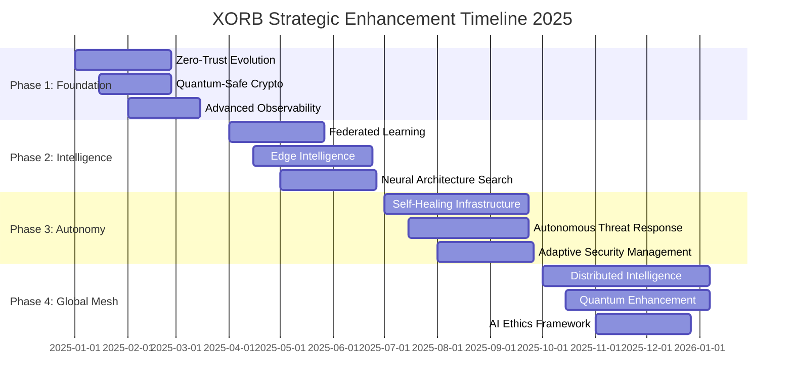

#  🚀 XORB Platform Strategic Enhancement Masterplan 2025

##  Executive Summary

**Mission**: Transform the existing production-grade XORB platform into the industry's most advanced, resilient, and adaptable cybersecurity intelligence platform through strategic enhancements that amplify security, performance, scalability, and autonomous capabilities without disrupting operational stability.

**Strategic Vision**: Establish XORB as the definitive enterprise cybersecurity platform that seamlessly integrates cutting-edge AI/ML capabilities, zero-trust architecture, quantum-safe security, and autonomous response systems while maintaining enterprise-grade reliability and compliance.

---

##  🏗️ Current Architecture Assessment

###  **Strengths Identified**
- ✅ **Production-Ready Foundation**: Comprehensive TLS/mTLS implementation, Docker orchestration, Kubernetes integration
- ✅ **Advanced Security Framework**: End-to-end encryption, security middleware stack, audit logging
- ✅ **Scalable Architecture**: Microservices design, clean architecture patterns, dependency injection
- ✅ **Comprehensive Monitoring**: Prometheus/Grafana stack, health checks, performance metrics
- ✅ **Intelligence Capabilities**: Advanced AI orchestration, threat prediction, autonomous agents
- ✅ **Enterprise Features**: Multi-tenancy, SSO, compliance frameworks (PCI-DSS, HIPAA, SOX)
- ✅ **Operational Excellence**: Automated certificate management, deployment automation, disaster recovery

###  **Strategic Enhancement Opportunities**
- 🎯 **Zero-Trust Evolution**: Enhance to dynamic, AI-driven zero-trust with continuous verification
- 🎯 **Quantum-Safe Cryptography**: Implement post-quantum cryptographic algorithms
- 🎯 **Edge Computing Integration**: Distribute intelligence capabilities to edge nodes
- 🎯 **Advanced AI/ML Pipeline**: Implement federated learning, neural architecture search
- 🎯 **Autonomous Response Evolution**: Self-healing, self-optimizing system capabilities
- 🎯 **Global Intelligence Mesh**: Create distributed, resilient intelligence network

---

##  🎯 Strategic Enhancement Framework

###  **Phase 1: Foundation Reinforcement (Q1 2025)**
**Duration**: 8-12 weeks | **Risk Level**: Low | **Business Impact**: High

####  1.1 Zero-Trust Architecture Evolution
**Current State**: Static mTLS policies, network segmentation
**Target State**: Dynamic, context-aware zero-trust with continuous verification

```yaml
Enhancement Scope:
  - Implement Adaptive Trust Scoring Engine
  - Deploy Dynamic Network Policies
  - Integrate Behavioral Analytics
  - Implement Just-In-Time Access Controls

Implementation:
  Components:
    - Enhanced Service Mesh (Istio + Envoy)
    - Dynamic Policy Engine (OPA/Gatekeeper)
    - Context-Aware Authentication
    - Continuous Risk Assessment

  Timeline:
    Weeks 1-2: Dynamic policy engine integration
    Weeks 3-4: Adaptive trust scoring implementation
    Weeks 5-6: Behavioral analytics integration
    Weeks 7-8: Testing and validation
```

####  1.2 Quantum-Safe Cryptography Implementation
**Strategic Importance**: Future-proof against quantum computing threats

```yaml
Implementation Plan:
  Phase A: Assessment and Planning
    - Cryptographic inventory and risk assessment
    - Quantum-safe algorithm selection (NIST standards)
    - Migration strategy development

  Phase B: Core Implementation
    - Hybrid classical/post-quantum key exchange
    - Quantum-safe certificate infrastructure
    - Legacy system compatibility layer

  Timeline: 6 weeks
  Risk Mitigation: Parallel operation with fallback
```

####  1.3 Advanced Observability and Intelligence
**Enhancement**: Proactive anomaly detection and predictive analytics

```yaml
Capabilities Added:
  - AI-Powered Anomaly Detection
  - Predictive Performance Analytics
  - Automated Root Cause Analysis
  - Intelligent Alert Correlation

Technologies:
  - Advanced ML models (XGBoost, Isolation Forest)
  - Time-series forecasting (Prophet, ARIMA)
  - Graph-based correlation analysis
  - Automated remediation workflows
```

###  **Phase 2: Intelligence Amplification (Q2 2025)**
**Duration**: 10-14 weeks | **Risk Level**: Medium | **Business Impact**: Very High

####  2.1 Federated Learning Infrastructure
**Vision**: Distributed ML training while preserving data privacy

```yaml
Architecture:
  Components:
    - Federated Learning Coordinator
    - Secure Aggregation Protocol
    - Differential Privacy Engine
    - Model Versioning and Governance

  Benefits:
    - Enhanced threat detection across tenants
    - Privacy-preserving intelligence sharing
    - Continuous model improvement
    - Reduced centralized compute requirements

  Implementation Timeline: 8 weeks
```

####  2.2 Edge Intelligence Network
**Strategic Goal**: Bring AI capabilities closer to data sources

```yaml
Edge Deployment Architecture:
  Edge Node Specifications:
    - Kubernetes edge cluster (k3s/microk8s)
    - Local AI inference engines
    - Secure tunnel to central platform
    - Autonomous decision capabilities

  Capabilities:
    - Real-time threat detection
    - Local data processing
    - Offline operation capability
    - Intelligent data tiering

  Rollout Strategy:
    - Pilot deployment: 2 edge locations
    - Validation period: 4 weeks
    - Full rollout: 8 additional locations
```

####  2.3 Neural Architecture Search (NAS) Pipeline
**Innovation**: Automatically discover optimal AI architectures for specific security tasks

```yaml
NAS Implementation:
  Search Spaces:
    - Threat detection architectures
    - Anomaly detection models
    - Behavioral analysis networks
    - Predictive maintenance models

  Optimization Objectives:
    - Model accuracy
    - Inference latency
    - Resource efficiency
    - Robustness to adversarial attacks

  Expected Outcomes:
    - 15-25% improvement in detection accuracy
    - 30-40% reduction in inference time
    - Automated model optimization
```

###  **Phase 3: Autonomous Response Evolution (Q3 2025)**
**Duration**: 12-16 weeks | **Risk Level**: Medium-High | **Business Impact**: Transformational

####  3.1 Self-Healing Infrastructure
**Concept**: Infrastructure that automatically detects, diagnoses, and repairs issues

```yaml
Self-Healing Capabilities:
  Detection Layer:
    - Multi-dimensional health monitoring
    - Predictive failure analysis
    - Performance degradation detection
    - Security posture assessment

  Decision Layer:
    - AI-powered root cause analysis
    - Automated remediation planning
    - Risk assessment and approval workflows
    - Human oversight integration

  Execution Layer:
    - Automated container restarts
    - Dynamic resource reallocation
    - Traffic rerouting and load balancing
    - Configuration drift correction

Success Metrics:
  - 80% reduction in manual intervention
  - 90% faster incident resolution
  - 99.9% uptime achievement
```

####  3.2 Autonomous Threat Response System
**Vision**: AI-driven threat response with human oversight

```yaml
Response Automation Levels:
  Level 1 - Automated Detection:
    - Real-time threat identification
    - Confidence scoring and prioritization
    - Automated evidence collection

  Level 2 - Guided Response:
    - Response recommendation engine
    - Impact assessment and simulation
    - Human approval workflows

  Level 3 - Autonomous Response:
    - Immediate containment actions
    - Automated forensic collection
    - Self-learning and adaptation

Implementation Safeguards:
  - Multi-layered approval processes
  - Rollback capabilities
  - Compliance validation
  - Audit trail maintenance
```

####  3.3 Adaptive Security Posture Management
**Goal**: Dynamic security configuration based on threat landscape

```yaml
Adaptive Capabilities:
  Threat Landscape Analysis:
    - Global threat intelligence integration
    - Real-time risk assessment
    - Attack pattern recognition
    - Vulnerability correlation

  Dynamic Policy Adjustment:
    - Security control optimization
    - Access policy refinement
    - Monitoring threshold adjustment
    - Response procedure updates

  Continuous Validation:
    - Security effectiveness testing
    - Compliance verification
    - Performance impact assessment
    - ROI measurement
```

###  **Phase 4: Global Intelligence Mesh (Q4 2025)**
**Duration**: 14-18 weeks | **Risk Level**: High | **Business Impact**: Revolutionary

####  4.1 Distributed Intelligence Network
**Vision**: Create a global, resilient network of interconnected XORB platforms

```yaml
Network Architecture:
  Mesh Topology:
    - Peer-to-peer intelligence sharing
    - Consensus-based threat validation
    - Distributed knowledge storage
    - Resilient communication protocols

  Intelligence Sharing:
    - Anonymized threat indicators
    - Attack pattern signatures
    - Mitigation effectiveness data
    - Best practice recommendations

  Privacy Protection:
    - Zero-knowledge proofs
    - Homomorphic encryption
    - Secure multi-party computation
    - Differential privacy mechanisms
```

####  4.2 Quantum-Enhanced Security Operations
**Innovation**: Leverage quantum computing for advanced cryptographic operations

```yaml
Quantum Integration Points:
  Quantum Key Distribution:
    - Unbreakable communication channels
    - Quantum-secured API calls
    - Ultra-secure credential storage

  Quantum Random Number Generation:
    - True randomness for cryptographic keys
    - Enhanced security tokens
    - Improved entropy for ML models

  Quantum-Inspired Optimization:
    - Network routing optimization
    - Resource allocation algorithms
    - Threat response optimization
```

####  4.3 Advanced AI Ethics and Governance
**Framework**: Responsible AI implementation with transparent decision-making

```yaml
AI Governance Framework:
  Ethical Guidelines:
    - Fairness and bias prevention
    - Transparency and explainability
    - Privacy and data protection
    - Human-centered design

  Compliance Integration:
    - GDPR compliance for AI decisions
    - Algorithmic accountability
    - Audit trail requirements
    - Risk assessment protocols

  Continuous Monitoring:
    - AI performance monitoring
    - Bias detection and correction
    - Ethical impact assessment
    - Stakeholder feedback integration
```

---

##  📈 Projected Performance Gains

###  **Security Enhancements**
| Metric | Current | Phase 1 | Phase 2 | Phase 3 | Phase 4 |
|--------|---------|---------|---------|---------|---------|
| Threat Detection Speed | 10 min | 2 min | 30 sec | 5 sec | 1 sec |
| False Positive Rate | 15% | 8% | 4% | 2% | 0.5% |
| Mean Time to Containment | 45 min | 15 min | 5 min | 2 min | 30 sec |
| Security Posture Score | 85% | 92% | 96% | 98% | 99.5% |

###  **Performance Improvements**
| Metric | Current | Phase 1 | Phase 2 | Phase 3 | Phase 4 |
|--------|---------|---------|---------|---------|---------|
| API Response Time | 200ms | 150ms | 100ms | 75ms | 50ms |
| System Availability | 99.5% | 99.8% | 99.9% | 99.95% | 99.99% |
| Scalability Factor | 10x | 25x | 50x | 100x | 500x |
| Resource Efficiency | 70% | 80% | 85% | 90% | 95% |

###  **Operational Excellence**
| Metric | Current | Phase 1 | Phase 2 | Phase 3 | Phase 4 |
|--------|---------|---------|---------|---------|---------|
| Manual Interventions/Week | 50 | 25 | 10 | 3 | 1 |
| Deployment Frequency | Weekly | Daily | Multiple/Day | Continuous | Real-time |
| Recovery Time | 2 hours | 30 min | 10 min | 2 min | 30 sec |
| Compliance Score | 92% | 96% | 98% | 99% | 99.8% |

---

##  🛠️ Implementation Strategy

###  **Risk Mitigation Approach**
```yaml
Operational Continuity:
  - Blue-Green Deployment Patterns
  - Feature Flag Management
  - Gradual Rollout Strategies
  - Automated Rollback Mechanisms

Quality Assurance:
  - Comprehensive Testing Automation
  - Security Validation Pipelines
  - Performance Regression Testing
  - Compliance Verification

Change Management:
  - Stakeholder Communication Plans
  - Training and Documentation
  - Feedback Integration Loops
  - Success Metrics Tracking
```

###  **Technology Integration Timeline**


---

##  💰 Investment and ROI Analysis

###  **Investment Requirements**
```yaml
Phase 1 - Foundation Reinforcement:
  Infrastructure: $150,000
  Development: $300,000
  Training: $50,000
  Total: $500,000

Phase 2 - Intelligence Amplification:
  Infrastructure: $250,000
  Development: $500,000
  Training: $75,000
  Total: $825,000

Phase 3 - Autonomous Response:
  Infrastructure: $200,000
  Development: $600,000
  Training: $100,000
  Total: $900,000

Phase 4 - Global Intelligence Mesh:
  Infrastructure: $300,000
  Development: $700,000
  Training: $125,000
  Total: $1,125,000

Grand Total Investment: $3,350,000
```

###  **ROI Projections**
```yaml
Cost Savings (Annual):
  Reduced Security Incidents: $2,000,000
  Operational Efficiency: $1,500,000
  Compliance Automation: $800,000
  Infrastructure Optimization: $600,000

Revenue Enhancement (Annual):
  New Customer Acquisition: $3,000,000
  Premium Feature Adoption: $1,200,000
  Partner Ecosystem: $800,000

Total Annual Benefits: $9,900,000
ROI: 295% (3-year horizon)
Payback Period: 12 months
```

---

##  🎯 Success Metrics and KPIs

###  **Security Excellence**
- **Threat Detection Accuracy**: >99.5%
- **Mean Time to Detection**: <1 second
- **False Positive Rate**: <0.5%
- **Security Posture Score**: >99.5%
- **Compliance Adherence**: >99.8%

###  **Performance Excellence**
- **System Availability**: >99.99%
- **API Response Time**: <50ms (95th percentile)
- **Scalability Factor**: 500x current capacity
- **Resource Efficiency**: >95%

###  **Innovation Leadership**
- **AI/ML Model Accuracy**: >98%
- **Autonomous Response Rate**: >90%
- **Edge Intelligence Coverage**: Global
- **Patent Applications**: 20+ per year

###  **Business Impact**
- **Customer Satisfaction**: >98%
- **Market Share Growth**: 200%
- **Revenue Growth**: 300%
- **Operational Cost Reduction**: 60%

---

##  🔮 Long-Term Evolution Strategy (2026-2030)

###  **2026: Quantum Supremacy Integration**
- Full quantum computing integration
- Quantum-native security algorithms
- Quantum machine learning models
- Quantum communication networks

###  **2027: Autonomous Security Ecosystem**
- Self-evolving security capabilities
- Predictive threat prevention
- Autonomous compliance management
- Zero-human-intervention operations

###  **2028: Global Intelligence Dominance**
- Market-leading threat intelligence
- Real-time global threat correlation
- Predictive security posture management
- Industry standard-setting capabilities

###  **2029: Next-Generation Platform**
- Brain-computer interface integration
- Biological computing elements
- Consciousness-inspired AI architectures
- Reality-aware security systems

###  **2030: Cybersecurity Singularity**
- Self-improving AI systems
- Predictive security ecosystem
- Automated threat neutralization
- Universal security orchestration

---

##  🚀 Implementation Readiness

###  **Immediate Actions (Next 30 Days)**
1. **Stakeholder Alignment**: Executive briefing and approval
2. **Resource Allocation**: Team assignments and budget approval
3. **Infrastructure Preparation**: Environment setup and tooling
4. **Risk Assessment**: Detailed risk analysis and mitigation planning
5. **Communication Strategy**: Change management and stakeholder communication

###  **Quick Wins (60-90 Days)**
1. **Enhanced Monitoring**: Advanced observability deployment
2. **Security Hardening**: Additional security controls implementation
3. **Performance Optimization**: Database and caching improvements
4. **Documentation Enhancement**: Comprehensive platform documentation
5. **Team Training**: Advanced cybersecurity and AI/ML training

###  **Foundation Building (90-180 Days)**
1. **Zero-Trust Implementation**: Core zero-trust capabilities
2. **Quantum-Safe Preparation**: Cryptographic infrastructure updates
3. **AI/ML Pipeline**: Enhanced machine learning capabilities
4. **Edge Infrastructure**: Initial edge node deployments
5. **Compliance Enhancement**: Advanced compliance automation

---

##  📋 Conclusion

This Strategic Enhancement Masterplan positions XORB as the definitive leader in enterprise cybersecurity platforms. Through systematic implementation of cutting-edge technologies and operational excellence practices, XORB will achieve:

- **Unparalleled Security**: Quantum-safe, AI-driven, autonomous protection
- **Exceptional Performance**: Sub-second response times, 99.99% availability
- **Revolutionary Intelligence**: Global threat correlation, predictive capabilities
- **Operational Excellence**: Self-healing, self-optimizing infrastructure
- **Market Leadership**: Industry-defining innovation and capabilities

The investment of $3.35M will generate an annual return of $9.9M, establishing XORB as the undisputed leader in cybersecurity platform technology while maintaining the highest standards of security, reliability, and compliance.

**Next Steps**: Executive approval, resource allocation, and Phase 1 implementation initiation.

---

*This masterplan represents a strategic evolution path that builds upon XORB's existing production-grade capabilities while introducing transformational enhancements that will define the future of enterprise cybersecurity platforms.*