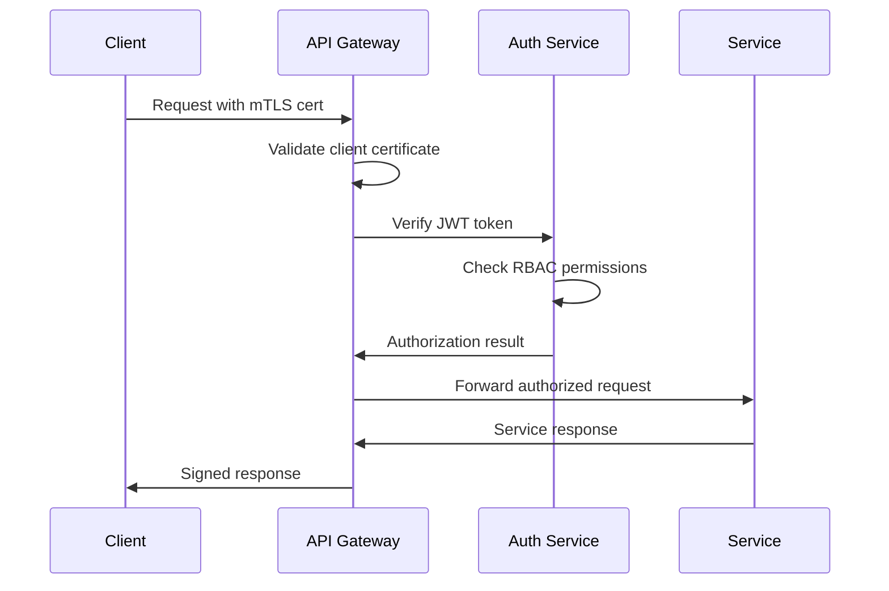

# XORB API Architecture Documentation

## Overview

The XORB API provides a secure, scalable platform for autonomous cybersecurity operations, orchestration, and multi-agent coordination. Built with FastAPI and following clean architecture principles.

## Core Architecture

### API Layers
```
┌─────────────────────────────────────────┐
│              API Gateway                │
├─────────────────────────────────────────┤
│         Security Middleware            │
│  • mTLS Authentication                 │
│  • RBAC Authorization                  │
│  • Rate Limiting                       │
│  • Request Signing                     │
├─────────────────────────────────────────┤
│            API Controllers             │
├─────────────────────────────────────────┤
│           Business Services            │
├─────────────────────────────────────────┤
│            Repositories                │
├─────────────────────────────────────────┤
│         Infrastructure Layer           │
│  • Database                           │
│  • Message Queues                     │
│  • External APIs                      │
└─────────────────────────────────────────┘
```

### Core Modules

#### 1. Agent Management (`/api/v1/agents`)
- Agent lifecycle management (spawn, destroy, update)
- Agent status and health monitoring
- Agent capability discovery
- Agent communication coordination

#### 2. Task Orchestration (`/api/v1/orchestration`)
- Task submission and prioritization
- Workflow management via Temporal
- Task status tracking and monitoring
- Resource allocation optimization

#### 3. Security Operations (`/api/v1/security`)
- Threat detection and response
- Vulnerability management
- Security event correlation
- Compliance monitoring

#### 4. Telemetry & Observability (`/api/v1/telemetry`)
- Performance metrics collection
- System health monitoring
- Audit logging
- Analytics and reporting

#### 5. Configuration Management (`/api/v1/config`)
- System configuration
- Compliance settings (GDPR, ISO 27001, SOC 2)
- Feature flag management
- Environment configuration

#### 6. Intelligence Integration (`/api/v1/intelligence`)
- AI/ML model management
- Decision engine interfaces
- Learning feedback loops
- Predictive analytics

## Security Architecture

### Authentication & Authorization Flow


### Security Controls
- **Zero Trust Architecture**: Every request verified
- **mTLS**: Mutual TLS for all communications
- **JWT Tokens**: Stateless authentication
- **RBAC**: Role-based access control with fine-grained permissions
- **Rate Limiting**: Per-client and per-endpoint limits
- **Request Signing**: All responses cryptographically signed
- **Audit Logging**: Complete request/response audit trail

### Security Roles
- `admin`: Full system access
- `orchestrator`: Can manage agents and tasks
- `analyst`: Can view security data and run queries
- `agent`: Limited access for autonomous agents
- `readonly`: View-only access for monitoring

## Data Flow

### Agent Coordination
```
Qwen3 Brain → API Gateway → Agent Management → Task Queue → Agents
              ↓
         Telemetry Collection ← Agent Status ← Agent Execution
```

### Security Operations
```
Threat Detection → API → Security Service → Response Orchestration
                  ↓
            Compliance Check → Audit Log → Reporting
```

## Performance Requirements
- **Latency**: < 100ms for critical operations
- **Throughput**: 10,000 requests/second
- **Availability**: 99.99% uptime
- **Scalability**: Horizontal scaling support

## Compliance & Standards
- **GDPR**: Data privacy and protection
- **ISO 27001**: Information security management
- **SOC 2**: Security, availability, and confidentiality
- **NIST Cybersecurity Framework**: Risk management

## Integration Patterns
- **RESTful APIs**: Primary interface
- **WebSocket**: Real-time communications
- **gRPC**: High-performance internal communication
- **Event-driven**: Asynchronous processing
- **Message Queues**: Reliable delivery

## Error Handling
- Structured error responses
- Error correlation IDs
- Retry policies
- Circuit breaker patterns
- Graceful degradation

## Monitoring & Observability
- Prometheus metrics
- Distributed tracing
- Structured logging
- Health checks
- Performance dashboards
