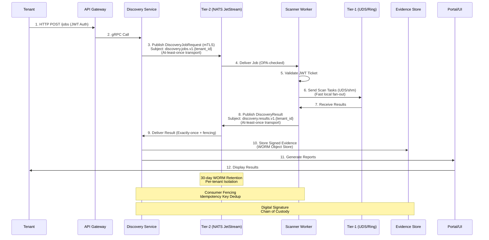

# XORB System Architecture Plan & Overview

**Status:** Accepted
**Date:** 2025-08-13
**Author:** Lead Systems Architect

---

## 1. Executive Summary

The XORB platform is a cloud-native, enterprise-grade Penetration Testing as a Service (PTaaS) and Security Event as a Service (SEaaS) stack. It provides continuous security discovery, vulnerability assessment, threat intelligence, and compliance reporting with legal-grade evidence. This architecture plan defines the system's structure, data flow, and operational principles, locking in core commitments to ensure scalability, security, and maintainability.

**Key Architectural Commitments:**

*   **Lock-Free Two-Tier Messaging (ADR-002):** A hybrid bus using local UNIX domain sockets/shared memory (Tier-1) for sub-millisecond intra-host communication and NATS JetStream (Tier-2) for durable, cross-node pub/sub with 30-day WORM retention.
*   **Strong Multi-Tenant Isolation (ADR-003):** Cryptographically enforced tenant boundaries using mTLS for service identity, JWT for API access, and per-tenant NATS topics with OPA-based access control.
*   **Immutable Evidence Chain-of-Custody (ADR-004):** All security findings are captured as tamper-evident, digitally signed `Evidence` records with a full audit trail, stored immutably.
*   **Canonical Monorepo & API Governance (ADR-001):** A single, well-structured repository (`/root/Xorb`) with Protobuf as the source of truth for all APIs and events, ensuring consistency and reducing drift.
*   **Zero Secret Tolerance (Security Push-Protection):** A strict "Vault-Only" policy for secret management, enforced by CI/CD and pre-commit hooks, with active GitHub push protection to prevent leakage.

---

## 2. System Context Diagram

```mermaid
graph LR
    subgraph "Clients"
        A[Tenant UI/API Clients]
        B[Security Analysts]
    end

    subgraph "XORB Platform"
        C[API Gateway]
        D[Core Services]
        E[PTaaS Jobs/Workers]

        subgraph "Messaging"
            F[Tier-1 Bus<br/>(UDS/shm)]
            G[Tier-2 Bus<br/>(NATS JetStream)]
        end

        subgraph "Authentication & Secrets"
            H[Vault PKI/JWT<br/>mTLS + Tenant JWTs]
        end

        subgraph "Data & Observability"
            I[Evidence Store<br/>(WORM Object Store + Index)]
            J[Observability<br/>(Prometheus, Grafana, Tempo)]
        end
    end

    K[External Integrations<br/>(SIEM, Ticketing)]

    A --> C
    B --> C
    C --> D
    D <--> F
    D <--> G
    E <--> F
    E <--> G
    F --> F
    G --> G
    D --> H
    E --> H
    D --> I
    E --> I
    I --> K
    D --> J
    E --> J
```

---

## 3. Module/Directory Map

| Directory | Purpose | Primary Language/Tech | Public API(s) | Depends on | ADR Mapping | Ownership (Team) |
| :--- | :--- | :--- | :--- | :--- | :--- | :--- |
| `proto/` | Source of truth for all APIs and event schemas. | Protobuf | gRPC/Protobuf | None | ADR-001 | Core Platform |
| `services/xorb-core/` | Central coordination, discovery orchestration, intelligence engine. | Go, Python | gRPC (internal), REST (external) | `proto/`, `platform/bus/`, `platform/auth/` | ADR-001, ADR-002, ADR-003 | Core Platform |
| `services/ptaas/` | Scanner execution, tool integration, job management. | Python, Rust | gRPC (internal) | `proto/`, `platform/bus/` | ADR-001, ADR-002 | PTaaS |
| `platform/bus/{localring,pubsub/natsjetstream}/` | Implementation of the Two-Tier Bus. | Go | Internal Go APIs | NATS Server, UDS/shm libraries | ADR-002 | Core Platform |
| `infra/{k8s,monitoring,vault}/` | Deployment, observability, and secret management. | Kubernetes, Prometheus, Vault | REST (Vault) | Cloud Provider | ADR-001, ADR-003 | SRE, Security |
| `sdks/{go,python,ts}/` | Client libraries for interacting with XORB services. | Go, Python, TypeScript | Language-native APIs | `proto/` | ADR-001 | Developer Experience |
| `docs/portal/` | User and developer documentation. | Markdown | Web UI | None | ADR-001 | Technical Writing |
| `examples/` | Sample code and integration guides. | Multiple | N/A | `sdks/` | ADR-001 | Developer Experience |
| `tools/` | Operational, development, and compliance tooling. | Bash, Python, Go | CLI | Various | ADR-001 | SRE, Security |

---

## 4. Data-Flow



---

## 5. Tenancy, Security, and Compliance

*   **Tenant Isolation Model:**
    *   **Messaging:** Per-tenant topics in NATS JetStream (e.g., `discovery.jobs.v1.tenant-123`). Access is controlled by OPA/ABAC policies that validate the client's certificate SPIFFE ID and JWT claims (`tier2_topics`).
    *   **Namespaces:** Kubernetes namespaces and Vault secret paths are aligned with tenant IDs for infrastructure-level isolation.
    *   **Data Storage:** Evidence and other tenant data are stored with explicit tenant ID prefixes or in tenant-specific buckets.

*   **mTLS and JWT Trust Model:**
    *   **Issuer:** HashiCorp Vault's PKI engine is the single source of truth for all service and client certificates. JWTs are signed by service keys managed in Vault's Transit engine.
    *   **TTLs & Rotation (ADR-003):**
        *   Service Certs: 30 days.
        *   Client Certs: 7 days.
        *   JWT Access Tokens: 1 hour.
        *   Discovery Job Tickets: 30 minutes.
    *   **Validation:** Services validate peer certificates against the Vault-issued CA chain and JWTs against public keys from Vault.

*   **Evidence Chain-of-Custody (ADR-004):**
    *   **Immutability:** Evidence records are stored in an object store with bucket-level WORM retention policies (3+ years for critical findings).
    *   **Integrity:** Each `Evidence` protobuf message is digitally signed (ECDSA-SHA256) by the producing service. The signature is part of the `ChainOfCustody` message.
    *   **Audit Trail:** Every custody transfer is logged within the `Evidence` message itself, creating an immutable trail.

*   **Secrets Handling:**
    *   **LOCKED (ADR-003):** The only approved secret management system is HashiCorp Vault. No secrets (keys, passwords, tokens) are ever stored in the codebase or environment variables.
    *   **GitHub Push-Protection Alignment:** Pre-commit hooks (`gitleaks`) and CI pipelines enforce secret scanning. The `tools/secrets/` directory contains remediation scripts for any historical leaks.

*   **Threat Model:**
    1.  **Threat:** Unauthorized access to another tenant's data/messages.
        *   **Mitigation:** Multi-layered isolation via mTLS, JWT scoping, OPA policies, and per-tenant NATS topics. Regular penetration testing.
    2.  **Threat:** Compromise of a service's private key/certificate.
        *   **Mitigation:** Short TTLs (7-30 days) and automated rotation via Vault. Incident response plan for emergency CA/key rotation.
    3.  **Threat:** Secret leakage in codebase.
        *   **Mitigation:** "Vault-Only" policy, mandatory `gitleaks` scanning, pre-commit hooks, and GitHub Advanced Security push protection.
    4.  **Threat:** Loss of evidence integrity/availability.
        *   **Mitigation:** WORM storage, digital signatures, cryptographic hashing, and geo-replicated backups.
    5.  **Threat:** Denial of Service via message replay storms.
        *   **Mitigation:** Idempotency keys with Redis-backed TTL cache for de-duplication at the consumer. Rate limiting and quotas per tenant.

---

## 6. Scalability & SLOs

*   **Target SLOs:**
    *   **API Availability:** 99.9%
    *   **Tier-1 Latency (P99):** < 1ms
    *   **Tier-2 Latency (P99):** < 100ms
    *   **Job Latency (P99):** Enqueue to first result < 250ms (ADR-002 Acceptance Criteria).

*   **Capacity Planning Assumptions:**
    *   **Tenants:** 1000 active tenants.
    *   **Jobs/Day:** 100,000 discovery jobs.
    *   **Messages/Second:** 1 million SYN/min sustained (ADR-002 Acceptance Criteria).

*   **Horizontal Scaling Strategy:**
    *   **NATS JetStream:** 3-node cluster with RF=3. Topics are the unit of horizontal distribution.
    *   **Worker Pools:** Scanner and discovery workers are stateless and scaled horizontally via Kubernetes deployments. Workers consume from NATS streams.
    *   **Sharding:** Services are designed to be stateless and horizontally scalable. Data partitioning (e.g., by `tenant_id`) is used in the Evidence Store and other backend systems.

*   **Backpressure & Overload Controls:**
    *   **Queues:** NATS JetStream provides durable queues with configurable limits.
    *   **Circuit Breakers:** Implemented in service clients to prevent cascading failures.
    *   **Rate Limits:** Per-tenant rate limits are enforced at the API Gateway and within services, backed by Redis for state.

---

## 7. Observability Contract

*   **Metrics:**
    *   **Business SLIs:**
        *   `xorb_jobs_completed_total{tenant_id, status="success|failure"}`
        *   `xorb_vulnerabilities_found_total{tenant_id, severity}`
        *   `xorb_portal_active_users`
    *   **Platform SLOs:**
        *   `xorb_api_request_duration_seconds{path, method, status}` (for P99 latency)
        *   `xorb_bus_messages_total{topic, tenant_id, direction, result="acked|nacked|dlq"}`
        *   `xorb_bus_latency_seconds{topic, tenant_id, direction}` (Tier-2 P99)
        *   `xorb_ring_latency_seconds{ring_name, direction, tenant_id}` (Tier-1 P99)
    *   **Technical Metrics (59-metrics aligned):**
        *   `xorb_auth_cert_validations_total{service, result="success|failure"}`
        *   `xorb_auth_jwt_validations_total{tenant_id, result="success|failure"}`
        *   `xorb_bus_exactly_once_dedup_total{topic, tenant_id, action="hit|miss"}`
        *   `xorb_bus_quota_usage_ratio{tenant_id, quota_type}`
        *   `xorb_evidence_storage_bytes{tenant_id, type}`
        *   `xorb_worker_cpu_usage_percent{worker_id}`
        *   *(...and ~10 more covering memory, disk, GC, etc.)*

*   **Tracing:**
    *   Distributed tracing spans cover the full lifecycle of a job: from `api-gateway` to `tier1-send` to `tier2-publish` to `discovery-workflow` to `tier2-consume` to `evidence-store`. Trace context is propagated using W3C Trace Context headers.

*   **Log Taxonomy:**
    *   **Security Events:** Authentication success/failure, authorization violations, key/cert issuance/revocation.
    *   **Audit:** All user actions, data access logs for evidence, configuration changes.
    *   **Application Logs:** Structured logs (INFO, WARN, ERROR) from all services, correlated with trace IDs.

---

## 8. CI/CD & Guardrails

*   **Required Checks (on every push/PR):**
    *   **Proto Lint/Codegen:** Ensure `proto/` files are valid and generated code is up-to-date.
    *   **ADR Compliance Gates:** Static analysis to ensure code aligns with documented ADRs (e.g., no Redis pub/sub, correct proto usage).
    *   **Secret Scanning:** `gitleaks` scan integrated into pre-commit and CI.
    *   **Redis-Bus Misuse Prevention:** Static analysis to forbid Redis Streams/PubSub usage outside of cache.
    *   **Size/Binary Gate:** Prevent large files or binaries from being committed.

*   **Branching/Release Rules:**
    *   **Main Branch:** Protected. Requires PR approval and passing all status checks.
    *   **Release Tags:** Semver tags (`v1.2.3`) are used for releases. Tags trigger the SDK publishing pipeline.
*   **SDK Publish:**
    *   Tagging `main` with a release tag automatically triggers builds and publishes to npm (TypeScript), PyPI (Python), and the Go proxy (Go).

---

## 9. Risks & Decisions

| Risk | Impact | Likelihood | Mitigation | Owner |
| :--- | :--- | :--- | :--- | :--- |
| **Message Ordering Pitfalls** | High (Incorrect correlation) | Medium | Use vector clocks or causal consistency checks for cross-tier messages. | Core Platform |
| **Replay Storms** | High (DoS) | Low | Implement robust idempotency keys + fencing + Redis cache with expiry. | Core Platform |
| **Secret Leakage** | Critical (Security Breach) | Medium | Enforce "Vault-Only" policy, mandatory secret scanning, push protection, and regular audits. | Security |
| **NATS Partitioning Limits** | High (Scalability) | Low | Monitor stream/partition counts; design services to distribute load across many topics. | SRE |
| **Performance Bottleneck in Tier-1 UDS** | Medium (Latency) | Medium | Plan and execute migration to shared-memory ring for critical paths. | Core Platform |
| **Evidence Storage Cost Overrun** | Medium (Cost) | High | Implement and enforce data retention policies. Use compression. | SRE |
| **Complexity of Exactly-Once Semantics** | Medium (Operational Overhead) | High | Thorough testing, clear documentation, and monitoring of dedup/cache hit rates. | Core Platform |
| **Dependency on Vault Availability** | High (System Outage) | Low | Vault is clustered. Services cache certs/keys for their TTL to tolerate short outages. | SRE |
| **Schema Drift (proto changes breaking consumers)** | High (System Instability) | Medium | Strict proto versioning, backward compatibility rules, and CI schema compatibility tests. | Core Platform |
| **Insufficient Observability** | High (Slow Debugging) | High | Implement the full metrics/tracing/logging contract from day one. | SRE |

---

## 10. Gaps & Concrete Next Steps

| Item | Why | What | Acceptance Criteria | Effort |
| :--- | :--- | :--- | :--- | :--- |
| **Git History Secret Purge** | Comply with "Vault-Only" policy and remove any historical risk. | Run `tools/secrets/remediate_git_history.sh` on a copy of the repo to identify and purge any potential secrets. Review and re-push history. | `git log -S "ghp_"` and similar searches return no results. | M |
| **Doc Portal Hardening** | Ensure internal architecture docs are not publicly accessible. | Audit `docs/portal/` content. Move internal ADRs to a protected internal location. Add authentication to the doc portal if it serves internal docs. | No internal design docs are accessible without auth. | S |
| **SDK Conformance Tests** | Guarantee SDKs correctly implement the API and handle auth/errors. | Create a shared test suite in `tests/sdk-conformance/` that each language SDK must pass. | All three SDKs pass the conformance suite. | L |
| **Performance Harness** | Validate SLOs and identify bottlenecks before scale. | Build a dedicated performance testing environment and suite (`/tests/performance/`) that can simulate target load (1M SYN/min). | Performance tests validate all SLOs and produce a report. | L |
| **Evidence Schema Validation Library** | Ensure all producers create valid evidence. | Create a shared library (Go/Python) that encapsulates evidence creation and validation logic, including signature generation. | Services use the library, and invalid evidence creation is prevented. | M |
| **Tenant Onboarding/Offboarding Runbook** | Standardize and secure tenant lifecycle management. | Document the process for safely provisioning and deprovisioning tenants, including Vault policies, NATS streams, storage buckets. | Runbook is documented and tested. | S |
| **OPA Policy Test Suite** | Ensure access control policies are correct and robust. | Write comprehensive unit tests for all Rego policies in `policy/`. | 100% coverage of critical OPA policies. | M |
| **Cross-Team ADR Review Process** | Ensure architectural decisions are well-understood. | Define a lightweight process for proposing and reviewing ADRs across teams. | New ADRs are reviewed by at least one member from each affected team. | S |

---

## 11. Roadmap (30/60/90-day)

*   **30 Days:**
    *   **Milestone:** Core Discovery Service MVP.
    *   **Goals:**
        1.  Implement basic `services/xorb-core/discovery/` service.
        2.  Integrate with Tier-2 NATS JetStream for job queuing.
        3.  Implement mTLS/JWT authentication for service-to-service calls.
        4.  Basic Evidence creation and storage (WORM).
    *   **Success Metrics:** Discovery jobs can be enqueued, processed by a worker, and evidence stored. Passes basic integration tests.
    *   **Merge Gates:** All code must pass CI checks, ADR compliance scans, and be reviewed.

*   **60 Days:**
    *   **Milestone:** PTaaS Scanner Integration & Tier-1 Bus.
    *   **Goals:**
        1.  Integrate initial scanners (e.g., `nmap`, `nuclei`) into `services/ptaas/`.
        2.  Implement Tier-1 UDS communication for scanner-to-discovery coordination.
        3.  Implement exactly-once semantics with fencing for result processing.
        4.  Deliver initial findings to the Portal/UI team.
    *   **Success Metrics:** A simple scan job can be executed end-to-end with results displayed. SLOs for latency are met.
    *   **Merge Gates:** Includes performance tests validating latency SLOs.

*   **90 Days:**
    *   **Milestone:** Multi-Tenant Beta & Compliance Foundation.
    *   **Goals:**
        1.  Enable support for multiple isolated tenants.
        2.  Fully implement OPA-based topic access control.
        3.  Implement full evidence chain-of-custody features (signatures, audit trail).
        4.  Publish v1.0.0 of all three SDKs.
    *   **Success Metrics:** Two or more distinct tenants can use the system securely without data leakage. SDKs are available for public consumption.
    *   **Merge Gates:** Includes security penetration test, secret scan verification, and successful beta user feedback.
