# XORB Data Flows & Architecture

**Audit Date**: 2025-08-15
**Architecture**: Microservices with NATS JetStream messaging
**Data Stores**: PostgreSQL, SQLite, Redis (cache-only)

## System Context Diagram

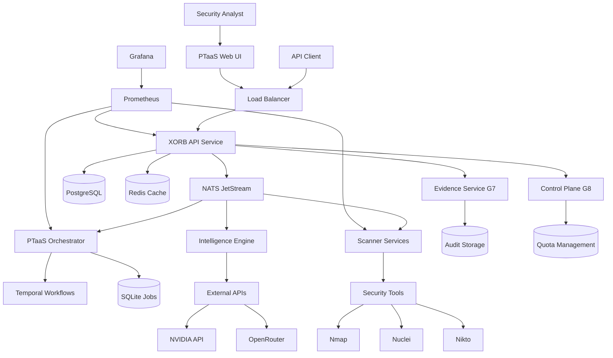

## PTaaS End-to-End Workflow

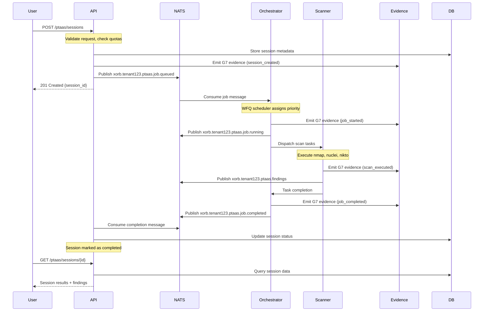

## NATS Subject Topology

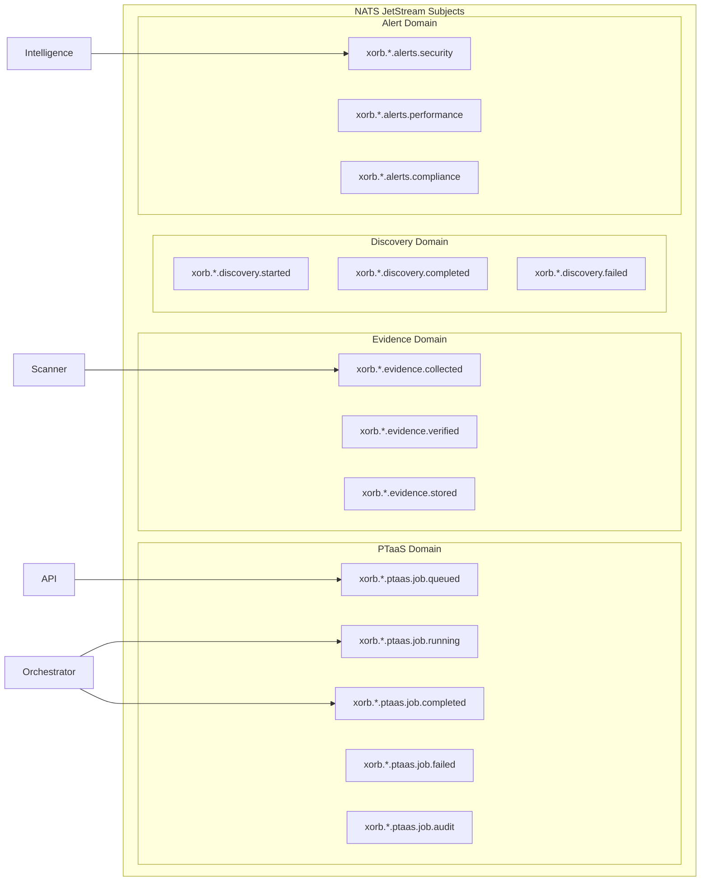

## Service Dependencies Flow

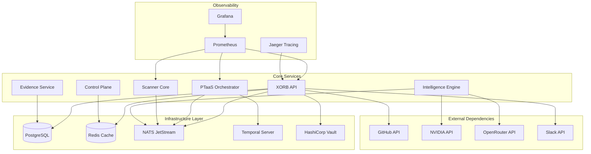

## PTaaS Job State Machine

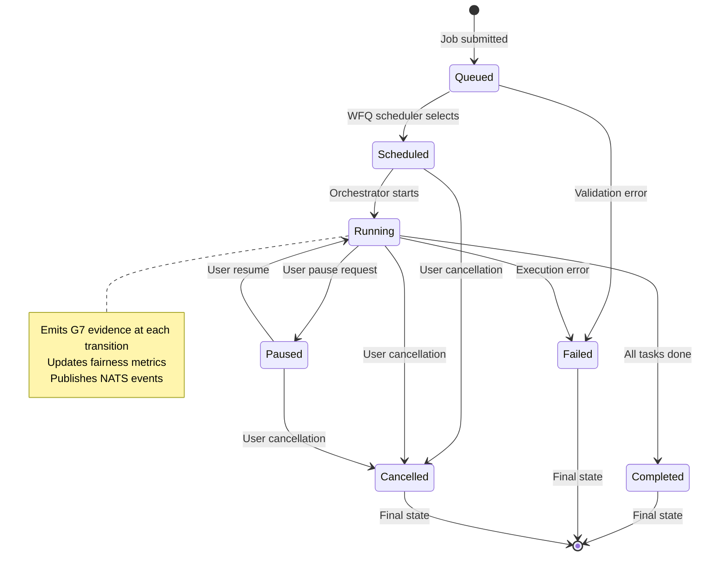

## Evidence Chain Flow (G7)

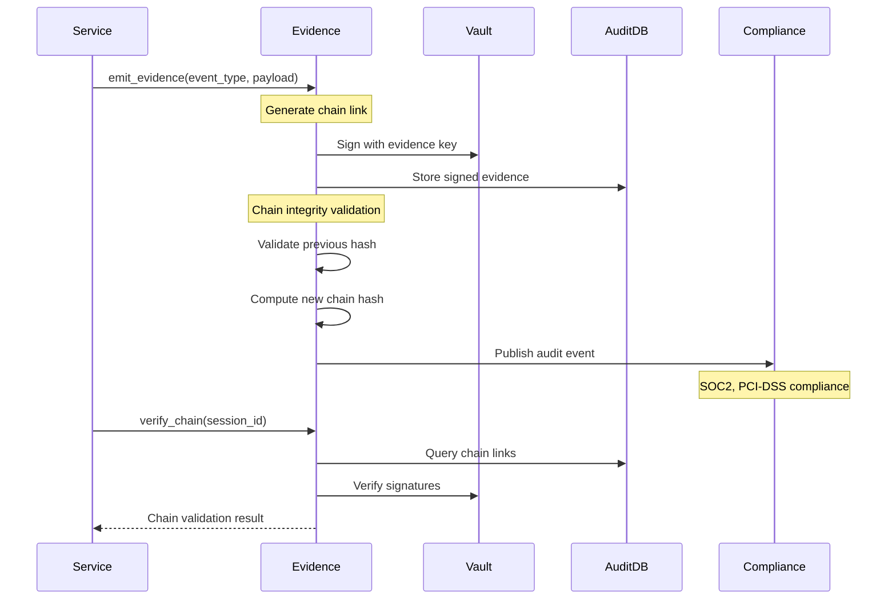

## Weighted Fair Queueing (G8) Flow

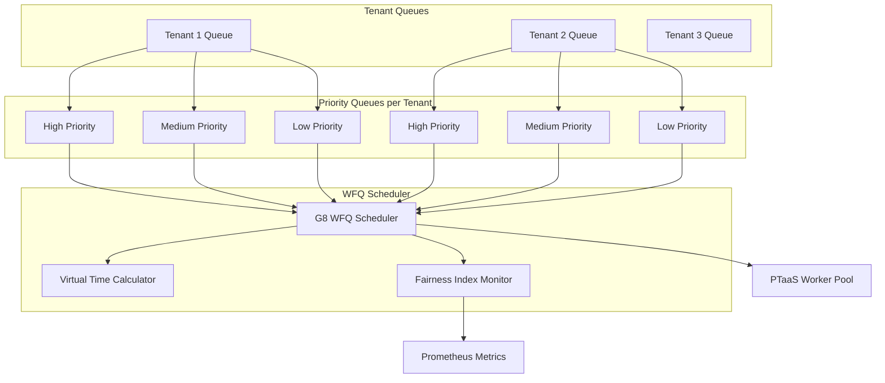

## Data Persistence Patterns

### PostgreSQL Schema
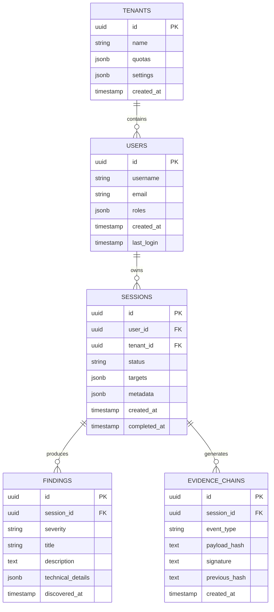

### NATS JetStream Configuration
```yaml
streams:
  xorb-ptaas:
    subjects: ["xorb.*.ptaas.>"]
    retention: workqueue
    max_age: 7d
    storage: file
    replicas: 3

  xorb-evidence:
    subjects: ["xorb.*.evidence.>"]
    retention: limits
    max_age: 7y  # 7 year retention for compliance
    storage: file
    replicas: 3

  xorb-alerts:
    subjects: ["xorb.*.alerts.>"]
    retention: limits
    max_age: 30d
    storage: memory
```

## Performance Data Flows

### Metrics Collection
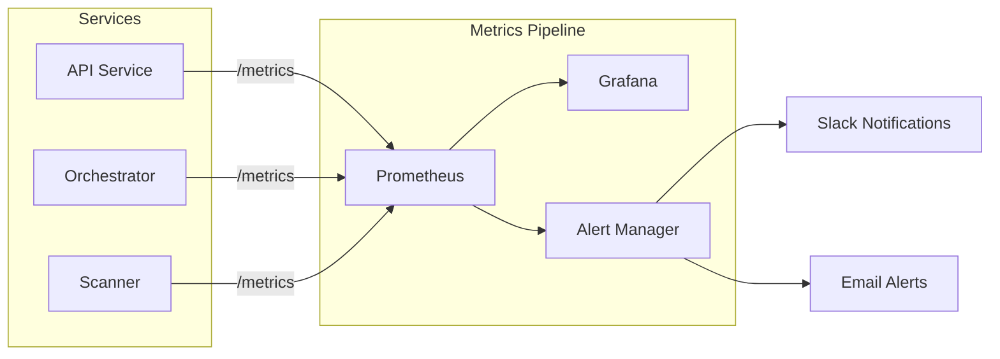

### Tracing Flow
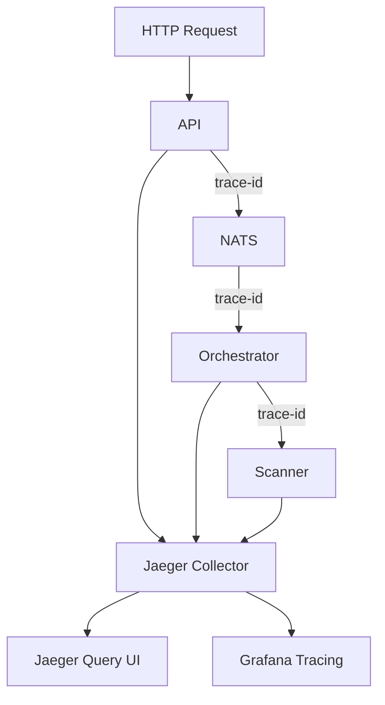

## Security Data Flows

### mTLS Certificate Flow
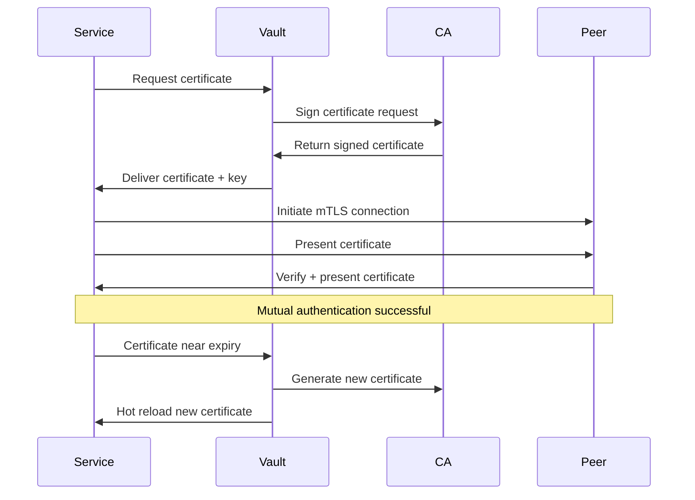

### Secret Management Flow
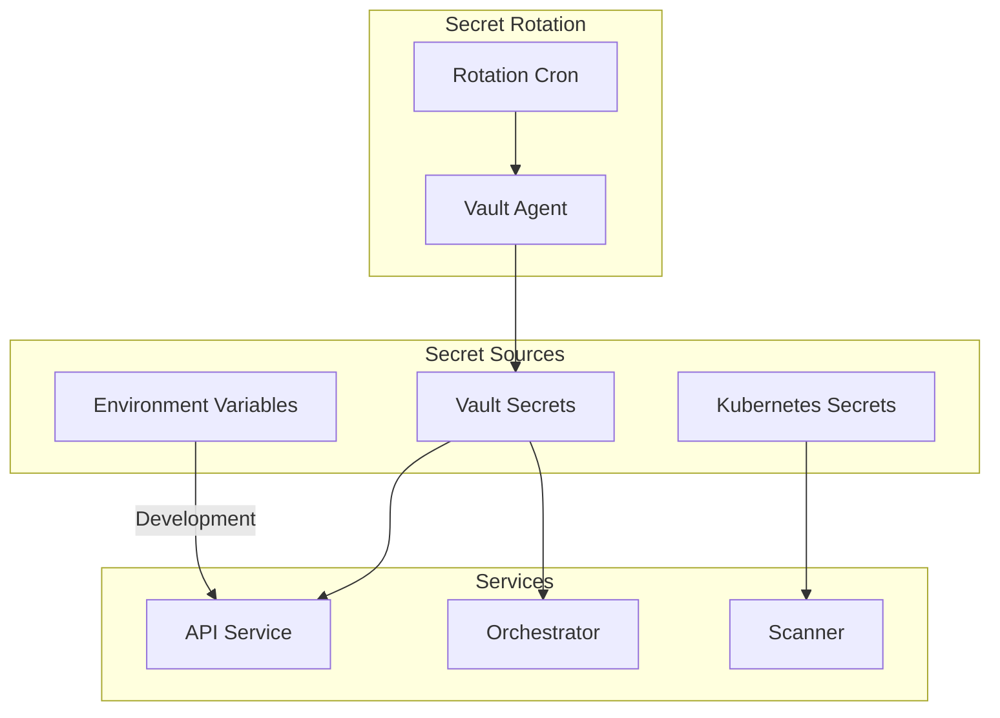

## Disaster Recovery Flows

### Backup Strategy
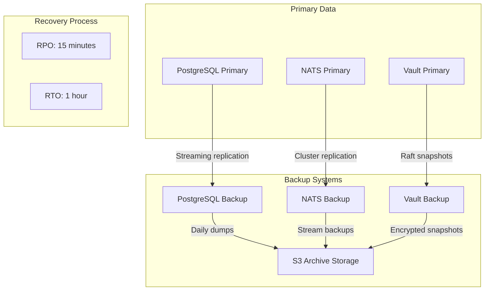

---

*This data flow documentation provides comprehensive visibility into how data moves through the XORB platform, including messaging patterns, state transitions, evidence chains, and operational flows.*
