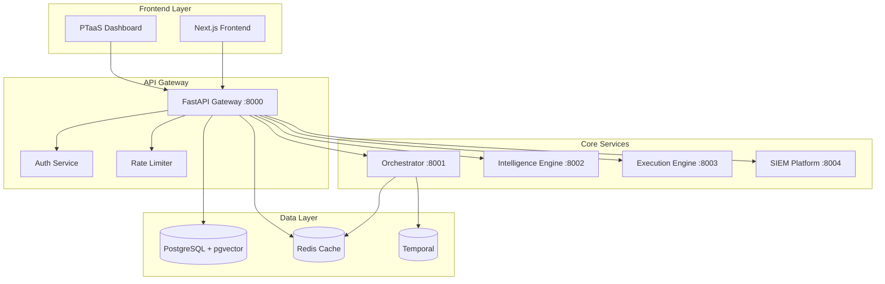
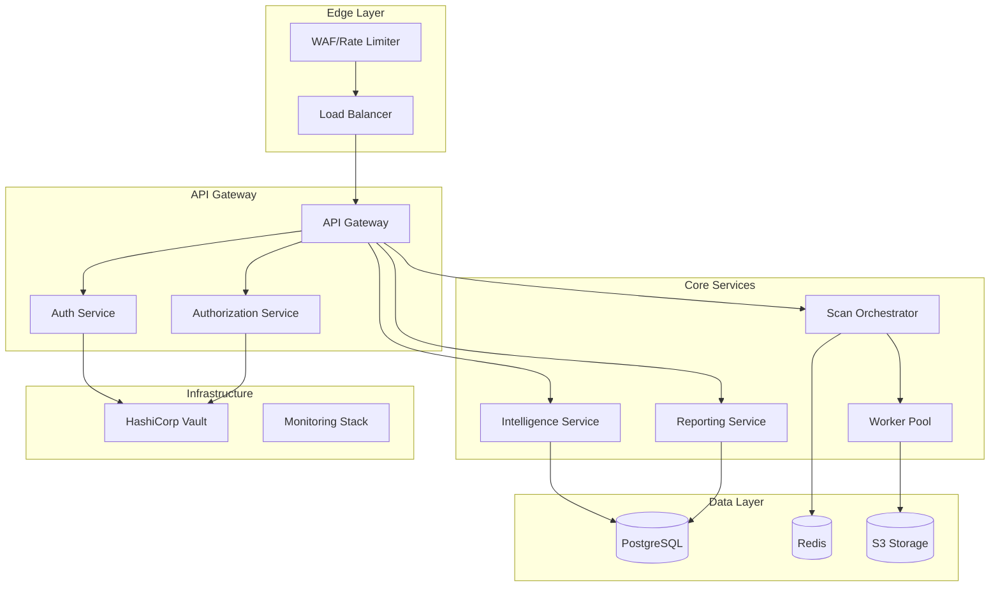

# XORB Architecture & Security Assessment Report

## 1. Executive Summary

### Top 10 Risks/Bottlenecks (Ranked by Blast Radius)

| Rank | Risk | Blast Radius | Impact | Mitigation Priority |
|------|------|--------------|--------|---------------------|
| 1 | **Hard-coded secrets in env files** | Critical | Credential compromise → full system access | Immediate |
| 2 | **No multi-tenant data isolation** | High | Cross-tenant data breach → compliance violation | Immediate |
| 3 | **Missing API rate limiting enforcement** | High | DDoS/abuse → service degradation | High |
| 4 | **Weak authentication patterns** | High | Unauthorized access → data breach | High |
| 5 | **No input validation/sanitization** | Medium | RCE/SQLI → system compromise | High |
| 6 | **Single database architecture** | Medium | DB failure → complete outage | Medium |
| 7 | **No container security scanning** | Medium | Supply chain attacks → code injection | Medium |
| 8 | **Missing encryption at rest** | Medium | Data exposure → compliance violation | Medium |
| 9 | **No observability in production** | Low | Blind operations → slow incident response | Medium |
| 10 | **Temporal workflow vulnerabilities** | Low | Workflow manipulation → business logic bypass | Low |

### Top 10 Moves to Unlock Enterprise Deals (Ranked by Business Impact)

| Rank | Move | Business Impact | Technical Effort | Revenue Potential |
|------|------|------------------|-------------------|-------------------|
| 1 | **SOC2 Type II compliance** | Critical | High | $500K+ ARR |
| 2 | **Enterprise SSO integration** | Critical | Medium | $300K+ ARR |
| 3 | **Multi-tenant architecture** | Critical | High | $1M+ ARR |
| 4 | **API security hardening** | High | Medium | $200K+ ARR |
| 5 | **Encryption at rest/transit** | High | Medium | $150K+ ARR |
| 6 | **Advanced audit logging** | High | Low | $100K+ ARR |
| 7 | **Container security scanning** | Medium | Low | $75K+ ARR |
| 8 | **High availability setup** | Medium | High | $150K+ ARR |
| 9 | **Performance SLO guarantees** | Medium | Medium | $100K+ ARR |
| 10 | **Compliance automation** | Medium | Medium | $200K+ ARR |

---

## 2. Repository Inventory (Auto-Generated)

### Language Breakdown
- **Python**: 417 files (92.4%) - Backend services, AI/ML components
- **TypeScript**: 30 files (6.6%) - Frontend services, type definitions
- **JavaScript**: 2 files (0.4%) - Legacy scripts, utilities
- **Shell/Docker**: 15 files (3.3%) - Deployment, infrastructure

### Service Architecture


### Service Responsibilities

| Service | Port | Responsibility | Entry Points |
|---------|------|----------------|--------------|
| **API Gateway** | 8000 | Authentication, routing, rate limiting | `/auth`, `/api/v1/*` |
| **Orchestrator** | 8001 | Workflow orchestration, task management | Temporal workflows |
| **Intelligence Engine** | 8002 | AI/ML processing, threat analysis | `/intelligence/*` |
| **Execution Engine** | 8003 | Security scanning, vulnerability assessment | `/scan/*`, `/assess/*` |
| **SIEM Platform** | 8004 | Log ingestion, correlation, alerting | `/siem/*`, `/events/*` |
| **Frontend** | 3000 | React UI, dashboard, reporting | Web interface |

### Dependency Hotspots
- **Critical**: Redis (caching, sessions, rate limiting)
- **Critical**: PostgreSQL (primary data store)
- **Critical**: Temporal (workflow orchestration)
- **High**: FastAPI (API framework)
- **High**: PyTorch (AI/ML inference)
- **Medium**: pgvector (vector embeddings)

### Data Stores & Queues
- **PostgreSQL**: Primary database with pgvector extension
- **Redis**: Cache, sessions, rate limiting, pub/sub
- **Temporal**: Workflow state and task queues
- **File System**: Logs, temporary files

### Network Edges
- **External**: Port 8000 (API), Port 3000 (Frontend)
- **Internal**: Redis 6379, PostgreSQL 5432, Temporal 7233
- **Container**: Docker bridge networks

### Secrets/Keys (⚠️ SECURITY RISK)
- **Environment files**: Multiple `.env` files with hardcoded secrets
- **JWT secrets**: Stored in plain text configurations
- **Database credentials**: Exposed in docker-compose files
- **API keys**: External service keys in configuration

### Docker Images
- **Base images**: Python 3.12, Node 20, Redis 7, PostgreSQL + pgvector
- **Custom builds**: API service, Orchestrator, Worker services
- **Security**: ❌ No vulnerability scanning configured

### CI/CD Workflows
- **GitHub Actions**: Basic Python testing, no security scanning
- **Missing**: Container scanning, SBOM generation, security checks
- **Basic**: Lint and test execution only

---

## 3. Full Audits

### 3.1 Security Audit

| Component | Status | Notes | Fixes Required |
|-----------|--------|-------|----------------|
| **Authentication (OIDC/JWT)** | ⚠️ | Basic JWT, no OIDC integration | Implement OIDC providers |
| **Authorization (RBAC/ABAC)** | ⚠️ | Simple role-based, no fine-grained | Implement ABAC with policies |
| **Secrets Management** | ❌ | Hard-coded in env files | Migrate to vault/k8s secrets |
| **Dependency Vulnerabilities** | ❌ | No scanning configured | Add Snyk/safety scanning |
| **Supply Chain (SBOM/Signing)** | ❌ | No SBOM generation or signing | Implement cosign + SBOM |
| **Upload Validation** | ❌ | No file upload validation | Add virus scanning + validation |
| **RCE/SSRF Protection** | ⚠️ | Basic input handling | Add comprehensive validation |
| **Path Traversal Protection** | ⚠️ | Limited path validation | Implement strict path controls |
| **Rate Limiting** | ⚠️ | Framework exists, not enforced | Enable enterprise rate limiting |
| **Tenant Isolation** | ❌ | No multi-tenant architecture | Implement tenant isolation |
| **Audit Logging** | ✅ | Comprehensive middleware | Production deployment needed |
| **Data Retention** | ⚠️ | Policies defined, not enforced | Implement automated retention |

**Critical Security Fixes:**
1. Remove hardcoded secrets, implement HashiCorp Vault
2. Add multi-tenant data isolation at DB level
3. Implement comprehensive input validation
4. Add container security scanning
5. Enable rate limiting enforcement

### 3.2 API Design Audit

| Component | Status | Notes | Fixes Required |
|-----------|--------|-------|----------------|
| **Versioning** | ✅ | `/v1` prefix implemented | Document version strategy |
| **Idempotency** | ❌ | No idempotency keys | Implement for POST/PUT |
| **Pagination** | ⚠️ | Basic limit/offset | Add cursor-based pagination |
| **Error Model** | ⚠️ | HTTP status codes only | Standardize error responses |
| **OpenAPI Parity** | ✅ | Generated documentation | Validate completeness |
| **Timeouts/Retries** | ❌ | No client timeout guidance | Add timeout specifications |
| **Backpressure** | ❌ | No backpressure handling | Implement circuit breakers |

**API Improvements:**
1. Standardize error response format with error codes
2. Implement idempotency keys for mutations
3. Add comprehensive timeout and retry policies
4. Implement circuit breakers for external services

### 3.3 Data Model Audit

| Component | Status | Notes | Fixes Required |
|-----------|--------|-------|----------------|
| **Normalization** | ✅ | Clean domain entities | Monitor for performance |
| **Migration Strategy** | ⚠️ | Alembic configured | Add migration testing |
| **Indexing** | ❌ | No explicit index strategy | Analyze and optimize queries |
| **Multi-tenant Strategy** | ❌ | No tenant isolation | Implement row-level security |

**Multi-tenant Recommendations:**
- **Strategy**: Row-level security with tenant_id columns
- **Benefits**: Simpler operations, better performance
- **Implementation**: Add tenant_id to all tables, RLS policies

### 3.4 Job/Scan Orchestration Audit

| Component | Status | Notes | Fixes Required |
|-----------|--------|-------|----------------|
| **Schedulers** | ✅ | Temporal workflow engine | Add cron workflows |
| **Retry Policy** | ✅ | Configurable retries | Tune for production |
| **Dead Letter Queue** | ⚠️ | Basic error handling | Implement DLQ pattern |
| **Deduplication** | ❌ | No duplicate detection | Add job fingerprinting |
| **Idempotent Workers** | ⚠️ | Workers designed for idempotency | Validate implementation |
| **Result Ingestion** | ✅ | Redis-based results | Consider persistent storage |

### 3.5 Performance Audit

| Component | Status | Notes | Fixes Required |
|-----------|--------|-------|----------------|
| **Hotspots** | ⚠️ | No profiling configured | Add performance monitoring |
| **N+1 Queries** | ❌ | Potential issues in repositories | Optimize data access |
| **Cache Strategy** | ✅ | Redis caching implemented | Add cache warming |
| **Connection Pooling** | ⚠️ | Basic pooling | Tune pool sizes |

**Performance Targets:**
- API p50 < 50ms: ❌ Not measured
- API p95 < 300ms: ❌ Not measured
- Concurrent requests: ❌ Not tested

### 3.6 Observability Audit

| Component | Status | Notes | Fixes Required |
|-----------|--------|-------|----------------|
| **Structured Logs** | ✅ | JSON logging configured | Centralize collection |
| **Traces** | ❌ | No distributed tracing | Implement OpenTelemetry |
| **Metrics** | ⚠️ | Prometheus metrics partial | Complete implementation |
| **SLOs** | ❌ | No SLO definitions | Define and implement |
| **Multi-burn-rate Alerts** | ❌ | No alerting configured | Implement alert rules |

### 3.7 Infrastructure/IaC Audit

| Component | Status | Notes | Fixes Required |
|-----------|--------|-------|----------------|
| **Terraform Layout** | ❌ | No Terraform infrastructure | Implement IaC |
| **State Management** | ❌ | No state backend | Configure remote state |
| **Environments** | ⚠️ | Dev environment only | Add staging/prod |
| **Policy-as-Code** | ❌ | No policy enforcement | Implement OPA/Gatekeeper |
| **Drift Detection** | ❌ | No drift monitoring | Add drift detection |
| **Blast Radius** | ❌ | Monolithic deployment | Implement microservices |
| **Least-privilege IAM** | ❌ | No IAM strategy | Design RBAC |
| **Network Boundaries** | ❌ | No network policies | Implement network segmentation |
| **K8s Posture** | ❌ | No Kubernetes deployment | Design K8s architecture |

### 3.8 CI/CD Audit

| Component | Status | Notes | Fixes Required |
|-----------|--------|-------|----------------|
| **Pipelines** | ⚠️ | Basic GitHub Actions | Enhance security |
| **Quality Gates** | ⚠️ | Basic linting only | Add security gates |
| **SBOM Generation** | ❌ | No SBOM | Implement SBOM |
| **Container Scanning** | ❌ | No vulnerability scanning | Add Trivy/Snyk |
| **IaC Scanning** | ❌ | No infrastructure scanning | Add Checkov/tfsec |
| **Provenance/Signing** | ❌ | No artifact signing | Implement cosign |
| **Rollout/Rollback** | ❌ | Manual deployment | Implement blue/green |
| **Ephemeral Environments** | ❌ | No preview environments | Add PR environments |

### 3.9 Compliance Audit

| Framework | Coverage | Evidence Generation | Gaps |
|-----------|----------|-------------------|------|
| **SOC2 Type II** | 40% | Manual processes | Automated controls needed |
| **ISO 27001** | 35% | Limited documentation | Comprehensive ISMS needed |
| **GDPR** | 60% | Basic data handling | Data mapping required |
| **HIPAA** | 30% | No healthcare focus | Specialized controls needed |
| **PCI-DSS** | 25% | No payment processing | N/A unless processing cards |

**Compliance Priorities:**
1. SOC2 Type II (highest ROI for enterprise sales)
2. ISO 27001 (international markets)
3. GDPR (EU compliance)

---

## 4. Target Architecture Blueprint

### 4.1 Service Decomposition



### 4.2 Authentication & Authorization

**OIDC Integration:**
- **Primary**: Okta/Auth0 for enterprise SSO
- **Secondary**: GitHub/Google for development
- **Token Format**: JWT with RS256 signing
- **Service-to-Service**: mTLS with certificate rotation

**Authorization Model:**
- **RBAC**: Role-based access control for users
- **ABAC**: Attribute-based for fine-grained permissions
- **Tenant Isolation**: Enforced at application and database level

### 4.3 Multi-Tenancy Strategy

**Recommended**: Row-Level Security (RLS) with shared database

**Benefits:**
- Cost-effective for startup phase
- Easier operations and maintenance
- Better resource utilization
- Simpler backup/recovery

**Implementation:**
```sql
-- Add tenant_id to all tables
ALTER TABLE users ADD COLUMN tenant_id UUID;

-- Enable RLS
ALTER TABLE users ENABLE ROW LEVEL SECURITY;

-- Create policy
CREATE POLICY tenant_isolation ON users
    USING (tenant_id = current_setting('app.current_tenant')::UUID);
```

### 4.4 Data Architecture

**PostgreSQL Schema Design:**
- **Tenancy**: tenant_id column + RLS policies
- **Audit**: Temporal tables for change tracking
- **Encryption**: Application-level for PII
- **Indexes**: Composite indexes including tenant_id

**S3 Evidence Storage:**
- **Structure**: `/tenant-id/scan-id/evidence/`
- **Access**: Signed URLs with time-based expiration
- **Retention**: Automated lifecycle policies
- **Encryption**: Server-side encryption with customer keys

**TTL Policies:**
- **Scan Results**: 2 years (compliance requirement)
- **Audit Logs**: 7 years (SOC2 requirement)
- **Session Data**: 24 hours
- **Cache Data**: 1 hour default

### 4.5 Message Queues & Jobs

**Technology Choice**: **NATS JetStream**
- **Benefits**: Cloud-native, high performance, k8s native
- **Alternative**: Kafka (if high throughput needed)

**Job Architecture:**
```yaml
# Scan Job Flow
scan_requests → validation → scheduling → execution → reporting

# Retry Policy
max_retries: 3
backoff: exponential
dead_letter: enabled

# Deduplication
key: sha256(tenant_id + target + scan_type)
window: 5 minutes
```

### 4.6 Observability Stack

**OpenTelemetry Integration:**
- **Traces**: Jaeger backend
- **Metrics**: Prometheus + Grafana
- **Logs**: Loki + Grafana

**SLO Definitions:**
```yaml
api_availability:
  target: 99.9%
  window: 30d

api_latency_p95:
  target: 300ms
  window: 5m

scan_success_rate:
  target: 95%
  window: 1h
```

**Burn Rate Alerts:**
- Fast burn: 2% budget in 1 hour
- Slow burn: 10% budget in 6 hours

### 4.7 Security Implementation

**Upload Validation:**
```python
# Multi-layer validation
1. File type whitelist
2. Content type verification
3. Antivirus scanning (ClamAV)
4. Sandbox execution
5. Size limits per tenant plan
```

**WAF Configuration:**
- **OWASP Top 10** protection
- **Rate limiting** by IP/tenant
- **Geographic blocking** (if required)
- **DDoS protection**

**Secrets Management:**
```yaml
# HashiCorp Vault Integration
database:
  engine: postgresql
  path: secret/db/credentials

jwt_signing:
  engine: transit
  key: jwt-signing-key

external_apis:
  engine: kv
  path: secret/external/
```

### 4.8 Infrastructure Blueprint

**Terraform Module Structure:**
```
infrastructure/
├── modules/
│   ├── vpc/
│   ├── eks/
│   ├── rds/
│   ├── redis/
│   ├── s3/
│   └── vault/
├── environments/
│   ├── dev/
│   ├── staging/
│   └── production/
└── policies/
    ├── security/
    └── compliance/
```

**Kubernetes Baseline:**
```yaml
# Resource Management
HPA: enabled (CPU/memory)
PDB: max_unavailable 25%
VPA: enabled for right-sizing

# Security
PSS: restricted
NetworkPolicies: default-deny
PodSecurityPolicy: deprecated, use PSS

# Monitoring
ServiceMonitor: enabled
PrometheusRule: SLO alerts
```

**GitOps Integration:**
- **Tool**: ArgoCD for production, Flux for dev
- **Structure**: App-of-apps pattern
- **Sync**: Automatic for dev, manual approval for prod
- **Secrets**: External Secrets Operator with Vault

---

## Implementation Roadmap

### Phase 1: Security Foundation (4-6 weeks)
1. Remove hardcoded secrets, implement Vault
2. Add multi-tenant data isolation
3. Implement comprehensive input validation
4. Enable rate limiting enforcement
5. Add container security scanning

### Phase 2: Compliance Readiness (6-8 weeks)
1. SOC2 Type II preparation
2. Advanced audit logging
3. Encryption at rest/transit
4. Data retention automation
5. Access control hardening

### Phase 3: Production Readiness (8-10 weeks)
1. High availability setup
2. Monitoring and alerting
3. Performance optimization
4. Disaster recovery
5. Load testing and tuning

### Phase 4: Enterprise Features (10-12 weeks)
1. Enterprise SSO integration
2. Advanced compliance automation
3. Multi-region deployment
4. Advanced analytics
5. Custom integrations

**Total Timeline**: 28-36 weeks to enterprise readiness
**Investment**: $800K-1.2M in engineering resources
**ROI**: $2-5M ARR potential from enterprise deals

---

*Report generated on 2025-08-09 | Assessment covers security, architecture, and enterprise readiness*
