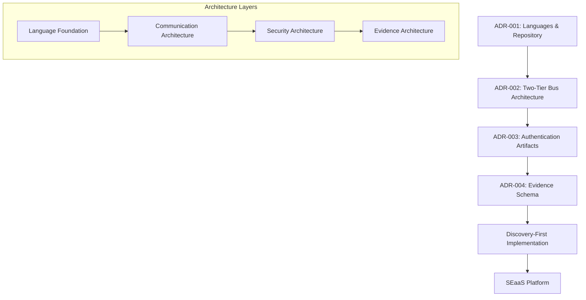

# Architecture Decision Records (ADRs)

This section contains the approved Architecture Decision Records (ADRs) that define the foundational architecture of the XORB platform. These decisions represent the culmination of research, analysis, and architectural trade-off considerations that shape our Discovery-First, Two-Tier Bus, SEaaS architecture.

## ADRs Overview

The XORB platform architecture is guided by these key decisions:

  

    <h3>ADR-001</h3>
    <h4>Languages & Repository Strategy</h4>
    
Defines the language stack and repository structure for the XORB platform, balancing current production needs with future Discovery-First architecture requirements.

    <a href="001-languages-repos" class="button button--primary">Read more</a>
  

  
  

    <h3>ADR-002</h3>
    <h4>Two-Tier Bus Architecture</h4>
    
Establishes the Two-Tier Bus architecture with local shared-memory rings and NATS JetStream for cross-node communication, with explicit Redis bus prohibition.

    <a href="002-two-tier-bus" class="button button--primary">Read more</a>
  

  
  

    <h3>ADR-003</h3>
    <h4>Authentication Artifacts</h4>
    
Defines the authentication architecture with mTLS, JWT, and Vault integration, ensuring enterprise-grade security and multi-tenant isolation.

    <a href="003-auth-artifact" class="button button--primary">Read more</a>
  

  
  

    <h3>ADR-004</h3>
    <h4>Evidence Schema</h4>
    
Establishes the evidence schema and chain of custody requirements for security scanning, vulnerability assessment, and forensic investigations.

    <a href="004-evidence-schema" class="button button--primary">Read more</a>
  

## Architecture Integration

These ADRs work together to form the foundation of the XORB platform architecture:

## Implementation Strategy

These ADRs form the foundation for the XORB platform's Discovery-First architecture, guiding implementation across four key areas:

1. **Language Foundation**: Python, TypeScript, and Rust for different platform components
2. **Communication Architecture**: Two-Tier Bus with local rings and NATS JetStream
3. **Security Architecture**: mTLS, JWT, and Vault integration for multi-tenant isolation
4. **Evidence Architecture**: Tamper-evident evidence collection and chain of custody

Each ADR builds upon the previous ones, creating a cohesive architecture that supports the platform's security scanning, threat intelligence, and compliance reporting capabilities.