# 🛡️ XORB PTaaS Architecture

## 🧠 Core Components

```mermaid
graph TD
    A[PTaaS Orchestration Layer] --> B[Vulnerability Scanning]
    A --> C[Exploitation Framework]
    A --> D[Compliance Validation]
    A --> E[Reporting Engine]
    A --> F[Attack Simulation]
    A --> G[Threat Intelligence]
    A --> H[Security Tool Integration]

    B --> B1[Nmap]
    B --> B2[OpenVAS]
    B --> B3[Nikto]

    C --> C1[Metasploit]
    C --> C2[SQLMap]
    C --> C3[Hydra]

    D --> D1[PCI-DSS]
    D --> D2[OWASP]
    D --> D3[NIST]

    E --> E1[PDF Reports]
    E --> E2[Interactive Dashboards]
    E --> E3[Executive Summaries]

    F --> F1[APT Simulation]
    F --> F2[Ransomware Simulation]
    F --> F3[Cloud Attack Simulation]

    G --> G1[MITRE ATT&CK]
    G --> G2[Threat Actor Profiles]
    G --> G3[IOC Feeds]

    H --> H1[Faraday]
    H --> H2[SIEM Integration]
    H --> H3[SOAR Integration]

    I[User Interface] --> A
    J[API Layer] --> A
    K[Automation Engine] --> A
```



## 🧩 Integration Points

- **Security Tools**: Direct integration with Nmap, Metasploit, SQLMap, Nikto, Hydra, OpenVAS
- **Compliance Frameworks**: Automated validation against PCI-DSS, OWASP, NIST, ISO 27001
- **Threat Intelligence**: MITRE ATT&CK mapping, threat actor profiles, IOC feeds
- **Reporting**: PDF reports, interactive dashboards, executive summaries
- **Automation**: API-driven orchestration, scheduled scans, automated remediation

## 📈 Workflow

1. **Planning**: Define scope, targets, and objectives
2. **Reconnaissance**: Passive and active information gathering
3. **Scanning**: Automated vulnerability detection
4. **Exploitation**: Proof-of-concept attacks
5. **Post-Exploitation**: Lateral movement and persistence
6. **Reporting**: Comprehensive documentation
7. **Remediation**: Guided fixes and verification
8. **Compliance**: Framework validation

## 🔐 Security

- Role-based access control
- Audit logging of all activities
- Encrypted communication
- Secure credential storage
- Multi-factor authentication
- API rate limiting
- Input validation and sanitization

## 📊 Monitoring

- Real-time attack visualization
- Vulnerability trending
- Compliance status dashboard
- Tool performance metrics
- Resource utilization monitoring
- Alerting and notifications
- Integration with SIEM/SOAR

## 🔄 Automation

- Scheduled scans
- API-driven execution
- Automated report generation
- Integration with CI/CD pipelines
- Webhook notifications
- Incident response workflows
- Remediation validation

## 🌐 Cloud Support

- AWS infrastructure testing
- Azure environment validation
- Google Cloud Platform assessment
- Kubernetes cluster security
- Serverless function analysis
- Cloud misconfiguration detection
- IAM policy validation

## 🤖 AI Integration

- Attack pattern recognition
- Threat intelligence correlation
- Vulnerability prioritization
- Risk prediction modeling
- Automated remediation suggestions
- Behavioral anomaly detection
- Attack path prediction

## 📦 Deployment Options

- SaaS platform
- On-premises installation
- Hybrid cloud deployment
- Containerized microservices
- Kubernetes orchestration
- Serverless functions
- CLI tooling

## 📚 Documentation

- API reference
- User guides
- Attack methodology
- Tool integration guide
- Compliance mapping
- Reporting templates
- Best practices

## 📞 Support

- 24/7 platform monitoring
- Enterprise SLAs
- Dedicated support team
- Knowledge base
- Training resources
- Community forums
- Professional services

## 🚀 Roadmap

- Enhanced AI capabilities
- Expanded compliance frameworks
- Advanced attack simulation
- Improved collaboration features
- Enhanced reporting options
- Mobile application
- Marketplace for modules/plugins

## 📈 Metrics

- Vulnerability detection rate
- False positive reduction
- Scan performance
- Resource utilization
- User engagement
- Compliance coverage
- Threat intelligence effectiveness

## 🧪 Testing

- Unit tests
- Integration tests
- End-to-end tests
- Performance tests
- Security tests
- Compliance tests
- Regression tests

## 📦 Packaging

- Docker images
- Kubernetes Helm charts
- CloudFormation templates
- Terraform modules
- Binary distributions
- Source code packages
- API client libraries

## 📁 Directory Structure

```
/root/Xorb/
├── ptaas/                  # PTaaS core components
├── tools/                  # Security tool integrations
├── reports/                # Report templates and generators
├── compliance/             # Compliance validation modules
├── simulations/            # Attack simulation scenarios
├── api/                    # API endpoints and documentation
├── docs/                   # Documentation and architecture
├── tests/                  # Test suite
├── config/                 # Configuration files
├── scripts/                # Utility scripts
└── venv/                   # Python virtual environment
```

## 🧠 Implementation Details

### Security Tool Integration

- **Nmap**: Network discovery and service mapping
- **Metasploit**: Exploitation framework
- **SQLMap**: SQL injection testing
- **Nikto**: Web server scanning
- **Hydra**: Password cracking
- **OpenVAS**: Vulnerability scanning
- **Faraday**: Collaborative penetration testing

### Attack Simulation

- **APT Simulation**: Advanced Persistent Threat scenarios
- **Ransomware Simulation**: Modern ransomware attack patterns
- **Cloud Infrastructure Attack**: Cloud misconfiguration exploitation
- **Insider Threat Simulation**: Malicious insider scenarios
- **Supply Chain Attack**: Third-party compromise scenarios

### Compliance Validation

- **PCI-DSS**: Payment Card Industry Data Security Standard
- **OWASP**: Open Web Application Security Project
- **NIST**: National Institute of Standards and Technology
- **ISO 27001**: Information Security Management
- **GDPR**: General Data Protection Regulation
- **HIPAA**: Health Insurance Portability and Accountability Act
- **SOC 2**: Systems and Organization Controls

### Reporting Engine

- **PDF Reports**: Comprehensive security reports
- **Interactive Dashboards**: Real-time visualization
- **Executive Summaries**: High-level overview
- **Technical Details**: In-depth findings
- **Remediation Guidance**: Step-by-step fixes
- **Compliance Mapping**: Framework alignment
- **Attack Visualization**: Graphical representation

### Threat Intelligence

- **MITRE ATT&CK**: Adversarial Tactics, Techniques, and Common Knowledge
- **Threat Actor Profiles**: Known attacker groups
- **IOC Feeds**: Indicators of Compromise
- **Vulnerability Intelligence**: CVE details and exploitability
- **Malware Analysis**: Sample analysis and behavior
- **Campaign Tracking**: Ongoing attack campaigns
- **TTPs**: Tactics, Techniques, and Procedures

### Automation Engine

- **Scheduled Scans**: Regular vulnerability checks
- **API-Driven Execution**: Programmatic control
- **Webhook Notifications**: Event-based alerts
- **Incident Response**: Automated workflows
- **Remediation Validation**: Fix verification
- **Report Generation**: Automated documentation
- **Tool Chaining**: Multi-tool workflows

### User Interface

- **Dashboard**: Overview of security posture
- **Scan Management**: Control and monitor scans
- **Report Viewer**: Interactive report navigation
- **Attack Simulation**: Scenario selection and execution
- **Compliance Center**: Framework validation
- **Threat Intelligence**: IOC and TTP visualization
- **Settings**: Configuration options

### API Layer

- **RESTful Endpoints**: Standardized API
- **GraphQL Support**: Flexible query language
- **Webhooks**: Event notifications
- **Authentication**: Secure access
- **Rate Limiting**: API protection
- **Documentation**: Interactive API explorer
- **SDKs**: Language-specific libraries

### Security Controls

- **Authentication**: Multi-factor and SSO
- **Authorization**: Role-based access control
- **Audit Logging**: Activity tracking
- **Data Encryption**: In transit and at rest
- **Secure Storage**: Credential management
- **Input Validation**: Sanitization and filtering
- **Rate Limiting**: API protection

### Monitoring and Logging

- **Real-time Dashboards**: Live visualization
- **Alerting**: Notification system
- **Log Aggregation**: Centralized logging
- **Performance Metrics**: System monitoring
- **Health Checks**: Service status
- **Audit Trails**: Activity tracking
- **SIEM Integration**: Security Information and Event Management

### Deployment and Operations

- **Containerization**: Docker and Kubernetes
- **Infrastructure as Code**: CloudFormation and Terraform
- **CI/CD Pipeline**: Automated testing and deployment
- **Backup and Recovery**: Data protection
- **Scaling**: Horizontal and vertical scaling
- **High Availability**: Redundant components
- **Disaster Recovery**: Business continuity

### Developer Experience

- **CLI Tooling**: Command-line interface
- **SDKs**: Language-specific libraries
- **API Explorer**: Interactive documentation
- **Sample Code**: Implementation examples
- **Developer Portal**: Resource hub
- **Community Support**: Forums and chat
- **Professional Services**: Expert assistance

### Performance Optimization

- **Caching**: Result storage
- **Parallel Execution**: Multi-threaded scanning
- **Resource Management**: Efficient utilization
- **Load Balancing**: Traffic distribution
- **Optimized Queries**: Database efficiency
- **Compression**: Data transfer reduction
- **Connection Pooling**: Resource reuse

### Extensibility

- **Plugin Architecture**: Modular components
- **Custom Modules**: Extend functionality
- **API Integrations**: Third-party tools
- **Scripting Support**: Custom workflows
- **Template System**: Custom reporting
- **Configuration Options**: Flexible settings
- **Community Contributions**: Open source extensions

### Internationalization

- **Multi-language Support**: Global accessibility
- **Localization**: Regional adaptation
- **Character Encoding**: Unicode support
- **Date/Time Formats**: Regional settings
- **Currency**: Localized representation
- **Units**: Measurement systems
- **Cultural Considerations**: Regional sensitivity

### Accessibility

- **WCAG Compliance**: Web Content Accessibility Guidelines
- **Keyboard Navigation**: Mouse-free operation
- **Screen Reader Support**: Visual impairment assistance
- **Contrast Optimization**: Visual clarity
- **Text Resizing**: Flexible font sizes
- **Alternative Text**: Image descriptions
- **Semantic Markup**: Structural clarity

### Legal and Compliance

- **Data Privacy**: GDPR, CCPA, etc.
- **Terms of Service**: Usage agreement
- **Acceptable Use Policy**: Ethical guidelines
- **Licensing**: Software licenses
- **Export Controls**: Regulatory compliance
- **Audit Readiness**: Compliance documentation
- **Data Sovereignty**: Geographic data control

### Community and Ecosystem

- **Open Source**: Publicly available code
- **Community Forums**: User discussions
- **Contribution Guidelines**: Developer participation
- **Plugin Marketplace**: Third-party extensions
- **Training Resources**: Learning materials
- **Certification Program**: Professional validation
- **Events and Conferences**: Community engagement

### Business Model

- **Freemium**: Basic features free, advanced features paid
- **Enterprise Licensing**: Organization-wide access
- **Cloud Subscription**: SaaS pricing
- **Professional Services**: Expert assistance
- **Training and Certification**: Educational offerings
- **Support Plans**: Technical assistance
- **Custom Development**: Tailored solutions

### Future Roadmap

- **AI-Powered Testing**: Enhanced automation
- **Quantum Security**: Post-quantum cryptography
- **Zero Trust Architecture**: Advanced security
- **Extended Detection and Response (XDR)**: Comprehensive protection
- **Secure Access Service Edge (SASE)**: Network security
- **Deception Technology**: Honeypots and decoys
- **Blockchain Security**: Distributed ledger protection

### Challenges and Considerations

- **False Positives/Negatives**: Accuracy challenges
- **Performance Impact**: Resource constraints
- **Tool Compatibility**: Integration issues
- **Regulatory Compliance**: Legal requirements
- **Ethical Use**: Responsible testing
- **Skill Requirements**: Expertise needed
- **Cost Management**: Resource optimization

### Success Metrics

- **Vulnerability Detection Rate**: Effectiveness
- **False Positive Rate**: Accuracy
- **Scan Performance**: Efficiency
- **User Satisfaction**: Customer feedback
- **Compliance Coverage**: Framework alignment
- **Threat Intelligence Value**: Actionable insights
- **Business Impact**: Organizational value

### Conclusion

The XORB PTaaS architecture provides a comprehensive, scalable, and secure platform for penetration testing and security assessment. With its modular design, extensive tool integration, and focus on automation and collaboration, it offers a powerful solution for organizations looking to enhance their security posture through proactive testing and validation.