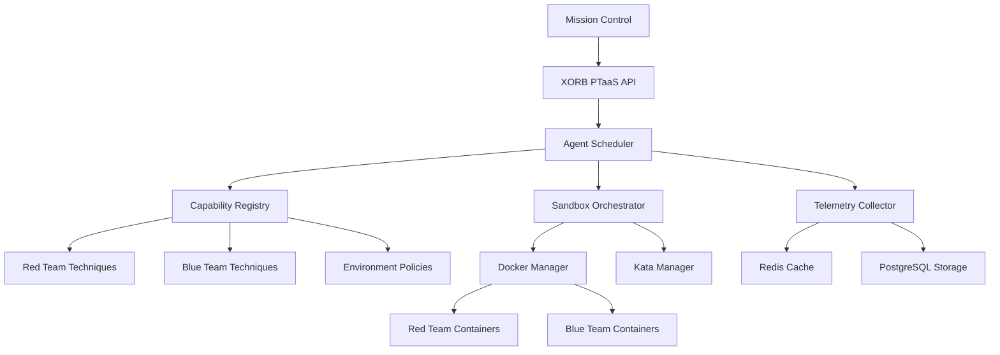

# XORB Red/Blue Agent Framework

##  Overview

The XORB Red/Blue Agent Framework is a sophisticated, self-learning cybersecurity automation platform designed for cyber ranges and Penetration Testing as a Service (PTaaS). It provides specialized autonomous agents that can execute both offensive (red team) and defensive (blue team) operations in isolated, containerized environments.

##  🎯 Key Features

###  **Specialized Agents**
- **Red Team Agents**: Reconnaissance, Exploitation, Persistence, Evasion, Collection
- **Blue Team Agents**: Detection, Analysis, Threat Hunting, Incident Response

###  **Sandbox Orchestration**
- Docker sidecar containers with TLS support
- Kata container integration for enhanced isolation
- Docker-in-Docker (DinD) capabilities
- Mission-based container labeling and TTL management
- Resource quotas and automatic cleanup

###  **Capability Management**
- JSON-based technique manifests following MITRE ATT&CK framework
- Environment-specific allow/deny policies (prod-safe vs staging-full)
- Dynamic capability validation and parameter checking
- Technique dependency resolution

###  **Autonomous Learning**
- Self-learning algorithms for tactic exploration
- Telemetry collection and learning state persistence
- Redis-backed caching with PostgreSQL long-term storage
- Adaptive technique selection based on success rates

###  **Enterprise Integration**
- Full integration with XORB PTaaS infrastructure
- REST API for mission management and agent orchestration
- Real-time monitoring and reporting
- Compliance and audit logging

##  🏗️ Architecture



###  Core Components

1. **Agent Scheduler**: Central orchestrator managing mission planning and agent coordination
2. **Capability Registry**: Manages technique definitions and environment policies
3. **Sandbox Orchestrator**: Handles container lifecycle and resource management
4. **Specialized Agents**: Individual agent implementations for specific attack/defense phases
5. **Telemetry System**: Collects execution data and learning metrics
6. **Autonomous Explorer**: Drives self-learning and technique adaptation

##  🚀 Quick Start

###  Prerequisites

- Docker Engine 20.10+ with buildx support
- Docker Compose 2.0+
- Python 3.9+
- Redis 7.0+
- PostgreSQL 14+ with pgvector extension
- Kata Containers (optional, for enhanced isolation)

###  Installation

1. **Clone and Setup Environment**
   ```bash
   git clone https://github.com/xorb-security/red-blue-agents.git
   cd red-blue-agents
   python -m venv venv
   source venv/bin/activate
   pip install -r requirements.txt
   ```

2. **Configure Environment**
   ```bash
   cp .env.example .env
   # Edit .env with your configuration
   ```

3. **Start Infrastructure Services**
   ```bash
   docker-compose up -d postgres redis temporal
   ```

4. **Initialize the Framework**
   ```bash
   python -m src.services.red_blue_agents.cli init
   ```

###  Basic Usage

####  Creating a Red Team Mission

```python
from src.services.red_blue_agents import AgentScheduler, CapabilityRegistry, SandboxOrchestrator

# Initialize framework
capability_registry = CapabilityRegistry()
sandbox_orchestrator = SandboxOrchestrator()
scheduler = AgentScheduler(capability_registry, sandbox_orchestrator)

await scheduler.initialize()

# Create mission
mission_config = {
    "name": "Web Application Assessment",
    "description": "Automated penetration test of web application",
    "environment": "staging",
    "objectives": [
        "Perform reconnaissance of target web application",
        "Identify and exploit web vulnerabilities",
        "Establish persistence mechanisms",
        "Evade detection systems"
    ],
    "targets": [
        {
            "host": "webapp.staging.company.com",
            "ports": [80, 443],
            "web_url": "https://webapp.staging.company.com"
        }
    ],
    "constraints": {
        "max_duration": 7200,  # 2 hours
        "stealth_mode": True
    }
}

mission_id = await scheduler.create_mission(mission_config)
await scheduler.start_mission(mission_id)
```

####  Creating a Blue Team Mission

```python
# Blue team defensive mission
blue_mission_config = {
    "name": "Threat Hunting Exercise",
    "description": "Proactive threat hunting across network infrastructure",
    "environment": "production",
    "objectives": [
        "Monitor network traffic for anomalies",
        "Hunt for lateral movement indicators",
        "Analyze system logs for IOCs",
        "Respond to detected threats"
    ],
    "targets": [
        {
            "network_segments": ["10.0.1.0/24", "10.0.2.0/24"],
            "log_sources": ["/var/log/syslog", "/var/log/auth.log"],
            "monitoring_duration": 3600
        }
    ]
}

blue_mission_id = await scheduler.create_mission(blue_mission_config)
await scheduler.start_mission(blue_mission_id)
```

##  📖 Documentation Structure

###  Core Documentation
- [**Architecture Guide**](./architecture.md) - Detailed system architecture and design decisions
- [**Installation Guide**](./installation.md) - Complete setup and deployment instructions
- [**Configuration Reference**](./configuration.md) - All configuration options and environment variables

###  Agent Documentation
- [**Red Team Agents**](./agents/red_team.md) - Red team agent capabilities and techniques
- [**Blue Team Agents**](./agents/blue_team.md) - Blue team agent capabilities and techniques
- [**Custom Agent Development**](./agents/custom_agents.md) - Creating custom agent implementations

###  Framework Components
- [**Capability Registry**](./components/capability_registry.md) - Technique management and validation
- [**Sandbox Orchestration**](./components/sandbox_orchestration.md) - Container management and isolation
- [**Telemetry System**](./components/telemetry.md) - Data collection and learning metrics
- [**Autonomous Learning**](./components/autonomous_learning.md) - Self-learning algorithms

###  API Reference
- [**REST API**](./api/rest_api.md) - HTTP API endpoints and schemas
- [**Python SDK**](./api/python_sdk.md) - Python client library and examples
- [**WebSocket API**](./api/websocket_api.md) - Real-time communication protocols

###  Security & Compliance
- [**Security Model**](./security/security_model.md) - Security architecture and threat model
- [**Compliance**](./security/compliance.md) - Regulatory compliance and audit trails
- [**Best Practices**](./security/best_practices.md) - Security implementation guidelines

###  Operations
- [**Monitoring & Alerting**](./operations/monitoring.md) - Operational monitoring and alerting
- [**Troubleshooting**](./operations/troubleshooting.md) - Common issues and solutions
- [**Performance Tuning**](./operations/performance.md) - Optimization and scaling guidelines

##  🔧 Configuration

###  Environment Policies

The framework supports multiple environments with different capability restrictions:

- **Production**: Only blue team techniques, limited risk levels
- **Staging**: Mixed red/blue teams, moderate restrictions
- **Development**: Full capabilities, minimal restrictions
- **Cyber Range**: Complete freedom, all techniques allowed

Example environment policy:

```json
{
  "staging": {
    "allowed_categories": [
      "reconnaissance",
      "detection",
      "analysis"
    ],
    "denied_techniques": [
      "exploit.web_sqli",
      "persist.web_shell"
    ],
    "max_risk_level": "high",
    "max_concurrent_agents": 15,
    "sandbox_constraints": {
      "network_isolation": true,
      "resource_limits": {
        "cpu_cores": 4,
        "memory_mb": 4096
      }
    }
  }
}
```

###  Technique Definitions

Techniques are defined using JSON manifests following the MITRE ATT&CK framework:

```json
{
  "id": "recon.port_scan",
  "name": "Port Scanning",
  "category": "reconnaissance",
  "description": "Discover open ports and services on target systems",
  "mitre_id": "T1046",
  "platforms": ["linux", "windows", "macos"],
  "risk_level": "low",
  "parameters": [
    {
      "name": "target",
      "type": "string",
      "required": true,
      "description": "Target IP address or hostname"
    }
  ]
}
```

##  🛡️ Security Considerations

###  Sandbox Isolation

- **Network Isolation**: Containers run in isolated networks with controlled egress
- **Resource Limits**: CPU, memory, and disk quotas prevent resource exhaustion
- **Privilege Restrictions**: Non-privileged containers with minimal capabilities
- **TTL Management**: Automatic cleanup prevents long-running malicious processes

###  Capability Validation

- **Environment Policies**: Strict allow/deny lists per environment
- **Parameter Validation**: Input sanitization and constraint checking
- **Dependency Resolution**: Ensure prerequisite techniques are available
- **Audit Logging**: Complete audit trail of all technique executions

###  Data Protection

- **Encryption**: All sensitive data encrypted at rest and in transit
- **Access Control**: Role-based access with principle of least privilege
- **Data Retention**: Configurable retention policies for telemetry data
- **Compliance**: SOC2, ISO27001, and other framework compliance

##  📊 Monitoring & Observability

###  Metrics

The framework exposes comprehensive metrics for monitoring:

- **Mission Metrics**: Success rates, execution times, resource usage
- **Agent Metrics**: Task completion, error rates, technique success
- **Sandbox Metrics**: Container lifecycle, resource utilization
- **Learning Metrics**: Model accuracy, exploration efficiency

###  Dashboards

Pre-built Grafana dashboards provide real-time visibility:

- **Executive Dashboard**: High-level mission and agent status
- **Operations Dashboard**: Infrastructure health and performance
- **Security Dashboard**: Threat landscape and technique effectiveness
- **Learning Dashboard**: Model performance and adaptation metrics

###  Alerting

Configurable alerts for critical events:

- **Mission Failures**: Automatic notification of failed missions
- **Security Events**: Detection of suspicious agent behavior
- **Resource Issues**: Container resource exhaustion or failures
- **Learning Anomalies**: Unexpected model behavior or performance degradation

##  🤝 Contributing

###  Development Setup

1. **Fork the Repository**
   ```bash
   git fork https://github.com/xorb-security/red-blue-agents.git
   cd red-blue-agents
   ```

2. **Setup Development Environment**
   ```bash
   python -m venv venv
   source venv/bin/activate
   pip install -r requirements-dev.txt
   pre-commit install
   ```

3. **Run Tests**
   ```bash
   pytest tests/
   pytest tests/integration/
   ```

###  Adding New Techniques

1. **Create Technique Definition**
   ```json
   // src/services/red_blue_agents/configs/techniques/my_techniques.json
   {
     "techniques": [
       {
         "id": "custom.my_technique",
         "name": "My Custom Technique",
         "category": "reconnaissance",
         // ... technique definition
       }
     ]
   }
   ```

2. **Implement Technique Handler**
   ```python
   # In appropriate agent class
   async def _my_technique(self, parameters: Dict[str, Any]) -> Dict[str, Any]:
       # Implementation
       return result
   ```

3. **Register Handler**
   ```python
   # In agent's _register_technique_handlers method
   self.technique_handlers["custom.my_technique"] = self._my_technique
   ```

###  Adding New Agents

1. **Extend BaseAgent**
   ```python
   from .base_agent import BaseAgent, AgentType

   class MyCustomAgent(BaseAgent):
       @property
       def agent_type(self) -> AgentType:
           return AgentType.RED_TEAM

       @property
       def supported_categories(self) -> List[str]:
           return ["custom_category"]

       async def _register_technique_handlers(self):
           # Register techniques
           pass
   ```

2. **Update Agent Registry**
   ```python
   # In AgentScheduler._discover_agent_types
   self.agent_registry["my_custom"] = {
       "name": "My Custom Agent",
       "categories": ["custom_category"],
       "image": "xorb/my-custom:latest"
   }
   ```

##  📄 License

This project is licensed under the MIT License - see the [LICENSE](../../LICENSE) file for details.

##  🆘 Support

- **Documentation**: [https://docs.xorb-security.com](https://docs.xorb-security.com)
- **Community**: [Discord](https://discord.gg/xorb-security)
- **Issues**: [GitHub Issues](https://github.com/xorb-security/red-blue-agents/issues)
- **Enterprise Support**: enterprise@xorb-security.com

##  🗂️ Related Projects

- [XORB PTaaS Platform](https://github.com/xorb-security/ptaas-platform)
- [XORB Threat Intelligence](https://github.com/xorb-security/threat-intelligence)
- [XORB Security Orchestration](https://github.com/xorb-security/security-orchestration)

- --

- *⚠️ Important Security Notice**

This framework is designed for authorized security testing and cyber range environments only. Users are responsible for ensuring compliance with all applicable laws and regulations. The framework includes safety mechanisms to prevent accidental deployment in production environments, but proper configuration and oversight are essential.