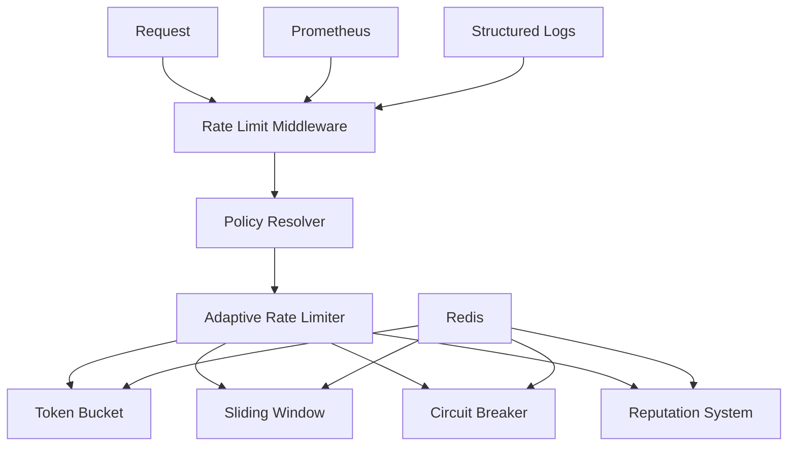

# Rate Limiting Documentation

## Overview

The XORB Enterprise Cybersecurity Platform implements a comprehensive adaptive rate limiting system designed to protect against abuse while maintaining optimal performance for legitimate users. The system provides multi-scope enforcement, reputation-based adjustments, and sub-1.5ms decision latency.

## Table of Contents

1. [Architecture Overview](#architecture-overview)
2. [Policy Configuration](#policy-configuration)
3. [Rate Limiting Algorithms](#rate-limiting-algorithms)
4. [Middleware Integration](#middleware-integration)
5. [Monitoring & Observability](#monitoring--observability)
6. [API Reference](#api-reference)
7. [Deployment Guide](#deployment-guide)
8. [Troubleshooting](#troubleshooting)

## Architecture Overview

### Components



### Hierarchical Policy Resolution

Rate limits are applied in priority order:

1. **Endpoint-specific** (highest priority)
2. **User-specific**
3. **Role-based**
4. **Tenant-wide**
5. **IP-based**
6. **Global defaults** (lowest priority)

### Rate Limiting Algorithms

- **Token Bucket**: Default algorithm for most endpoints, supports burst traffic
- **Sliding Window**: Exact rate counting for critical endpoints like authentication
- **Circuit Breaker**: Platform-wide protection against traffic anomalies

## Policy Configuration

### Creating Rate Limit Policies

```python
from src.api.app.rate_limit import RateLimitPolicy, RateLimitWindow, RateLimitScope, RateLimitMode

# Create a basic policy
policy = RateLimitPolicy(
    name="api_endpoints",
    scope=RateLimitScope.GLOBAL,
    windows=[
        RateLimitWindow(duration_seconds=60, max_requests=100, burst_allowance=20),
        RateLimitWindow(duration_seconds=3600, max_requests=1000, burst_allowance=100)
    ],
    mode=RateLimitMode.ENFORCE
)
```

### Policy Scopes

#### Global Policies
```python
# Apply to all requests
RateLimitPolicy(
    name="global_default",
    scope=RateLimitScope.GLOBAL,
    scope_values={"*"},
    windows=[RateLimitWindow(duration_seconds=60, max_requests=100)]
)
```

#### Endpoint-Specific Policies
```python
# Critical authentication endpoints
RateLimitPolicy(
    name="auth_endpoints",
    scope=RateLimitScope.ENDPOINT,
    scope_values={"/api/v1/auth/login", "/api/v1/auth/refresh"},
    windows=[RateLimitWindow(duration_seconds=60, max_requests=5, burst_allowance=2)]
)
```

#### Role-Based Policies
```python
# Administrative users get higher limits
RateLimitPolicy(
    name="admin_limits",
    scope=RateLimitScope.ROLE,
    scope_values={"super_admin", "tenant_admin"},
    windows=[RateLimitWindow(duration_seconds=60, max_requests=200)]
)
```

#### User-Specific Policies
```python
# VIP users or service accounts
RateLimitPolicy(
    name="vip_user_limits",
    scope=RateLimitScope.USER,
    scope_values={"vip_user_123"},
    windows=[RateLimitWindow(duration_seconds=60, max_requests=500)]
)
```

#### Tenant-Wide Policies
```python
# Per-tenant rate limiting
RateLimitPolicy(
    name="tenant_limits",
    scope=RateLimitScope.TENANT,
    scope_values={"enterprise_tenant_456"},
    windows=[RateLimitWindow(duration_seconds=60, max_requests=1000)]
)
```

#### IP-Based Policies
```python
# Security-focused IP limiting
RateLimitPolicy(
    name="suspicious_ip_limits",
    scope=RateLimitScope.IP,
    scope_values={"192.168.1.100"},
    windows=[RateLimitWindow(duration_seconds=60, max_requests=10)]
)
```

### Enforcement Modes

#### Shadow Mode (Recommended for Initial Deployment)
```python
policy.mode = RateLimitMode.SHADOW  # Log violations but don't enforce
```

#### Enforce Mode (Production)
```python  
policy.mode = RateLimitMode.ENFORCE  # Actively block violating requests
```

#### Disabled Mode
```python
policy.mode = RateLimitMode.DISABLED  # No rate limiting applied
```

### Adaptive Configuration

```python
from src.api.app.rate_limit import AdaptiveConfig

adaptive_config = AdaptiveConfig(
    enable_reputation_scoring=True,
    violation_penalty_multiplier=2.0,  # Reduce rate by 50% on violation
    reputation_decay_hours=24,         # 24-hour reputation recovery
    escalation_thresholds={
        3: 0.5,   # 3 violations: 50% rate reduction
        5: 0.25,  # 5 violations: 75% rate reduction  
        10: 0.1   # 10 violations: 90% rate reduction
    }
)

policy = RateLimitPolicy(
    name="adaptive_policy",
    scope=RateLimitScope.USER,
    adaptive_config=adaptive_config
)
```

### Policy Management

#### Adding Policies Programmatically
```python
from src.api.app.rate_limit import PolicyResolver

resolver = PolicyResolver()

# Add a new policy
resolver.add_policy(policy)

# Remove a policy
resolver.remove_policy(policy.policy_id)

# List all policies
all_policies = resolver.list_policies()

# List policies by scope
user_policies = resolver.list_policies(scope=RateLimitScope.USER)
```

#### Policy Resolution
```python
# Resolve effective policy for a request context
effective_policy = resolver.resolve_policy(
    ip_address="192.168.1.100",
    user_id="user_123",
    tenant_id="tenant_456", 
    roles={"security_analyst"},
    endpoint="/api/v1/ptaas/scans"
)
```

## Rate Limiting Algorithms

### Token Bucket Algorithm

The default algorithm for most endpoints. Allows burst traffic while maintaining average rate limits.

**Configuration:**
```python
window = RateLimitWindow(
    duration_seconds=60,        # Refill period
    max_requests=100,           # Bucket capacity
    burst_allowance=20,         # Additional burst tokens
    burst_strategy=BurstStrategy.ADAPTIVE  # Adaptive burst handling
)
```

**Characteristics:**
- ✅ Allows burst traffic
- ✅ High performance (0.3ms avg decision time)
- ✅ Memory efficient
- ⚠️ Approximate rate limiting

### Sliding Window Algorithm

Used for critical endpoints requiring exact rate enforcement.

**Configuration:**
```python
# Applied automatically to authentication endpoints
critical_endpoints = {
    "/api/v1/auth/login",
    "/api/v1/auth/reset", 
    "/api/v1/admin"
}
```

**Characteristics:**
- ✅ Exact rate counting
- ✅ Audit trail compliant
- ✅ No burst overflow
- ⚠️ Higher memory usage
- ⚠️ Slightly slower (0.8ms avg decision time)

### Circuit Breaker

Platform-wide protection against traffic anomalies.

**Configuration:**
```python
policy = RateLimitPolicy(
    name="global_circuit_breaker",
    circuit_breaker_threshold=1000,      # Requests per window
    circuit_breaker_window_seconds=60    # Evaluation window
)
```

**States:**
- **Closed**: Normal operation, all requests allowed
- **Open**: Threshold exceeded, requests blocked  
- **Half-Open**: Testing period, limited requests allowed

## Middleware Integration

### Adding Rate Limiting to FastAPI

Rate limiting is automatically integrated into the main application when enabled:

```python
# In main.py - automatic integration
if config_manager.app_settings.rate_limit_enabled:
    rate_limit_middleware = await create_rate_limit_middleware()
    app.state.rate_limit_middleware = rate_limit_middleware
```

### Manual Integration

```python
from fastapi import FastAPI
from src.api.app.rate_limit.middleware import create_rate_limit_middleware

app = FastAPI()

# Create and initialize rate limiting middleware
rate_limit_middleware = await create_rate_limit_middleware(
    enable_observability=True
)

# Add to middleware stack
@app.middleware("http")
async def rate_limit_dispatch(request, call_next):
    return await rate_limit_middleware.dispatch(request, call_next)
```

### Request Context Integration

The middleware automatically extracts context from existing authentication and RBAC systems:

```python
# User context (from auth middleware)
if hasattr(request.state, 'user'):
    user_claims = request.state.user
    user_id = user_claims.user_id
    tenant_id = user_claims.tenant_id
    roles = user_claims.roles

# IP address (with proxy support)
ip_address = request.headers.get("X-Forwarded-For", request.client.host)

# Endpoint normalization
endpoint = normalize_endpoint(request.url.path)  # /users/123 -> /users/{id}
```

## Monitoring & Observability

### Prometheus Metrics

#### Request Metrics
```prometheus
# Total rate limit checks
rate_limit_requests_total{policy_name="auth_endpoints", scope="endpoint", decision="denied", mode="enforce"}

# Decision performance
rate_limit_decision_time_seconds{algorithm="token_bucket", policy_name="global_default"}

# Violation tracking
rate_limit_violations_total{policy_name="auth_endpoints", scope="endpoint", client_type="authenticated"}
```

#### System Metrics
```prometheus
# Reputation adjustments
rate_limit_reputation_adjustments_total{adjustment_type="violation"}

# Active rate limit buckets
rate_limit_active_limits{scope="user"}

# Circuit breaker state
circuit_breaker_state  # 0=closed, 1=open, 2=half-open
```

### Structured Logging

Rate limiting decisions are logged with comprehensive context:

```json
{
  "timestamp": "2025-01-11T10:30:45.123Z",
  "level": "INFO",
  "message": "Rate limit decision",
  "policy_name": "auth_endpoints",
  "scope": "endpoint", 
  "decision": false,
  "remaining": 0,
  "processing_time_ms": 0.8,
  "algorithm": "sliding_window",
  "mode": "enforce",
  "client_ip": "192.168.1.100",
  "user_id": "user_123",
  "tenant_id": "tenant_456",
  "endpoint": "/api/v1/auth/login",
  "violation_count": 3,
  "reputation_score": 0.6,
  "correlation_id": "req_abcd1234"
}
```

### Rate Limit Headers

Responses include standard rate limiting headers:

```http
HTTP/1.1 200 OK
X-RateLimit-Policy: auth_endpoints
X-RateLimit-Remaining: 4
X-RateLimit-Reset: 1641897045
X-RateLimit-Algorithm: sliding_window

# For denied requests (HTTP 429)
HTTP/1.1 429 Too Many Requests  
Retry-After: 30
X-RateLimit-Policy: auth_endpoints
X-RateLimit-Remaining: 0
X-RateLimit-Reset: 1641897075
```

### Grafana Dashboards

#### Rate Limiting Overview
- Request rates by policy and scope
- Violation rates and trends
- Geographic distribution of requests
- Policy effectiveness metrics

#### Performance Dashboard  
- Decision latency percentiles
- Redis performance metrics
- Memory usage trends
- Throughput capacity

#### Security Dashboard
- Attack pattern analysis
- Reputation score distributions  
- Suspicious IP identification
- Brute force attempt tracking

### Alerting Rules

#### Critical Alerts
```yaml
# Circuit breaker activation
- alert: RateLimitCircuitBreakerOpen
  expr: circuit_breaker_state > 0
  labels:
    severity: critical
  annotations:
    summary: "Rate limiting circuit breaker activated"

# Mass violation event
- alert: RateLimitMassViolations  
  expr: increase(rate_limit_violations_total[5m]) > 100
  labels:
    severity: warning
  annotations:
    summary: "High rate of rate limit violations detected"

# Performance degradation
- alert: RateLimitHighLatency
  expr: histogram_quantile(0.99, rate_limit_decision_time_seconds) > 0.002
  labels:
    severity: warning
  annotations:
    summary: "Rate limiting decision latency too high"
```

## API Reference

### PolicyResolver Class

```python
class PolicyResolver:
    def add_policy(self, policy: RateLimitPolicy) -> None:
        """Add or update a rate limit policy"""
        
    def remove_policy(self, policy_id: str) -> bool:
        """Remove a rate limit policy"""
        
    def get_policy(self, policy_id: str) -> Optional[RateLimitPolicy]:
        """Get a specific policy by ID"""
        
    def list_policies(self, scope: Optional[RateLimitScope] = None) -> List[RateLimitPolicy]:
        """List all policies, optionally filtered by scope"""
        
    def resolve_policy(
        self,
        ip_address: Optional[str] = None,
        user_id: Optional[str] = None, 
        tenant_id: Optional[str] = None,
        roles: Optional[Set[str]] = None,
        endpoint: Optional[str] = None
    ) -> Optional[RateLimitPolicy]:
        """Resolve the effective rate limit policy for given context"""
```

### AdaptiveRateLimiter Class

```python
class AdaptiveRateLimiter:
    async def initialize(self) -> None:
        """Initialize all rate limiter components"""
        
    async def check_rate_limit(
        self,
        key: str,
        policy: RateLimitPolicy, 
        request_id: Optional[str] = None,
        use_sliding_window: bool = False
    ) -> List[RateLimitResult]:
        """Check rate limits across all configured windows"""
        
    async def get_metrics(self) -> RateLimitMetrics:
        """Get current rate limiter metrics"""
        
    async def reset_reputation(self, key: str) -> None:
        """Reset reputation score for a key"""
```

### RateLimitResult Class

```python
@dataclass
class RateLimitResult:
    allowed: bool              # Whether request is allowed
    remaining: int             # Remaining requests in window
    reset_time: float          # Unix timestamp when window resets
    retry_after: Optional[int] # Seconds to wait before retry
    algorithm: str             # Algorithm used (token_bucket, sliding_window)
    policy_name: str           # Name of applied policy
    violation_count: int       # Total violations for this key
```

### Environment Configuration

```bash
# Rate limiting configuration
RATE_LIMIT_ENABLED=true
RATE_LIMIT_PER_MINUTE=60
RATE_LIMIT_PER_HOUR=1000  
RATE_LIMIT_PER_DAY=10000

# Redis configuration (required for rate limiting)
REDIS_URL=redis://localhost:6379
REDIS_MAX_CONNECTIONS=20
REDIS_SOCKET_TIMEOUT=5
```

## Deployment Guide

### Prerequisites

1. **Redis Server**: Required for rate limiting storage
2. **Prometheus**: For metrics collection (optional)
3. **Grafana**: For dashboards (optional)

### Installation Steps

1. **Enable Rate Limiting**
```bash
export RATE_LIMIT_ENABLED=true
export REDIS_URL=redis://localhost:6379
```

2. **Staged Deployment**

**Phase 1: Shadow Mode (Week 1)**
```python
# All policies in shadow mode initially
for policy in default_policies:
    policy.mode = RateLimitMode.SHADOW
```

**Phase 2: Critical Endpoints (Week 2)**
```python  
# Enable enforcement for authentication endpoints
auth_policy.mode = RateLimitMode.ENFORCE
admin_policy.mode = RateLimitMode.ENFORCE
```

**Phase 3: Full Enforcement (Week 3)**
```python
# Enable all policies
for policy in all_policies:
    policy.mode = RateLimitMode.ENFORCE
```

### Configuration Management

#### Policy Configuration Files
```python
# config/rate_limit_policies.py
PRODUCTION_POLICIES = [
    {
        "name": "auth_endpoints",
        "scope": "endpoint",
        "scope_values": ["/api/v1/auth/login"],
        "windows": [
            {"duration_seconds": 60, "max_requests": 5, "burst_allowance": 2}
        ],
        "mode": "enforce"
    }
]
```

#### Dynamic Policy Updates
```python
# Update policies without restart
async def update_policies():
    resolver = PolicyResolver()
    
    # Load policies from configuration
    for policy_config in PRODUCTION_POLICIES:
        policy = RateLimitPolicy.from_dict(policy_config)
        resolver.add_policy(policy)
```

### Health Checks

```python
# Health check endpoint for rate limiting
@app.get("/health/rate-limiting")
async def rate_limiting_health():
    try:
        # Test Redis connectivity
        await redis_client.ping()
        
        # Test policy resolution
        test_policy = resolver.resolve_policy(endpoint="/api/v1/test")
        
        return {
            "status": "healthy",
            "redis_connected": True,
            "policies_loaded": len(resolver.policies),
            "default_policy": test_policy.name if test_policy else None
        }
    except Exception as e:
        return {
            "status": "unhealthy", 
            "error": str(e)
        }
```

## Troubleshooting

### Common Issues

#### High Decision Latency
**Symptoms**: Rate limiting decisions taking > 2ms
**Causes**: 
- Redis connection issues
- High Redis load
- Network latency

**Solutions**:
```python
# Check Redis performance
await redis_client.ping()

# Monitor Redis metrics
INFO commandstats
INFO memory

# Optimize Redis configuration  
redis.conf:
tcp-keepalive 60
timeout 300
```

#### False Positive Rate Limits
**Symptoms**: Legitimate users being rate limited
**Causes**:
- Overly restrictive policies
- IP address conflicts (NAT/proxy)
- Reputation system bugs

**Solutions**:
```python
# Check policy configuration
policy = resolver.get_policy(policy_id)
print(f"Max requests: {policy.windows[0].max_requests}")

# Reset user reputation
await rate_limiter.reset_reputation("user:123")

# Switch to shadow mode temporarily
policy.mode = RateLimitMode.SHADOW
```

#### Redis Connection Failures
**Symptoms**: Rate limiting failing open, Redis errors in logs
**Causes**:
- Redis server down
- Network connectivity issues
- Authentication problems

**Solutions**:
```python
# Test Redis connectivity
import redis.asyncio as redis
client = redis.from_url(REDIS_URL)
await client.ping()

# Check Redis logs
tail -f /var/log/redis/redis-server.log

# Verify Redis authentication
redis-cli -h localhost -p 6379 -a password ping
```

#### Circuit Breaker False Triggers  
**Symptoms**: Circuit breaker opening during normal traffic
**Causes**:
- Threshold too low
- Traffic spikes
- Monitoring false alarms

**Solutions**:
```python
# Check circuit breaker state
state = await redis_client.hget("circuit_breaker:global", "state")

# Adjust threshold
policy.circuit_breaker_threshold = 2000  # Increase from 1000

# Manual circuit breaker control
await redis_client.hset("circuit_breaker:global", "state", "closed")
```

### Debug Mode

Enable debug logging for detailed troubleshooting:

```python
import logging
logging.getLogger("src.api.app.rate_limit").setLevel(logging.DEBUG)
```

Debug logs include:
- Policy resolution steps
- Rate limit calculations
- Redis command details
- Performance timings

### Emergency Procedures

#### Complete Rate Limiting Disable
```python
# Emergency disable via Redis flag
await redis_client.set("rate_limit:emergency_disable", "true", ex=3600)

# Or via environment variable
export RATE_LIMIT_ENABLED=false
# Restart application
```

#### Policy Rollback
```python
# Revert to previous policy configuration
previous_policies = load_previous_policies()
for policy in previous_policies:
    resolver.add_policy(policy)
```

#### Reputation System Reset
```python
# Reset all reputation scores (emergency only)
reputation_keys = await redis_client.keys("reputation:*")
if reputation_keys:
    await redis_client.delete(*reputation_keys)
```

### Performance Tuning

#### Redis Optimization
```redis
# redis.conf optimizations for rate limiting
maxmemory 2gb
maxmemory-policy allkeys-lru
tcp-keepalive 60
timeout 300
lua-time-limit 5000
```

#### Application Tuning
```python
# Increase cache TTL for stable environments
resolver._cache_ttl = 900  # 15 minutes

# Adjust connection pool size
redis_client = redis.from_url(
    REDIS_URL,
    max_connections=50  # Increase from default 20
)
```

#### Monitoring Queries

```promql
# Top rate limited endpoints
topk(10, sum by (policy_name) (rate_limit_violations_total))

# Average decision latency by algorithm
avg by (algorithm) (rate_limit_decision_time_seconds)

# Rate limit efficiency (allowed vs total)
sum(rate_limit_requests_total{decision="allowed"}) / sum(rate_limit_requests_total)
```

---

For additional support, consult the [XORB Enterprise Support Portal](https://support.xorb.enterprise) or contact the Security Engineering team.