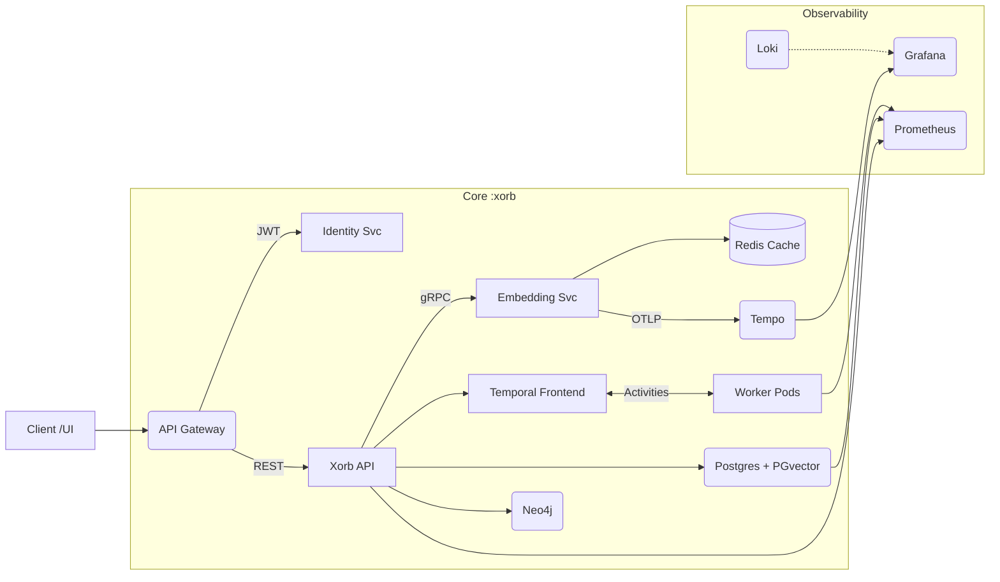

# Xorb 2.0 — Strategic Refinement & Re‑Architecture Report  
*Generated: 2025‑07‑25*

---

## 0  Executive Summary
Xorb has grown from a red‑teaming PoC into a multi‑service AI security‑intelligence fabric.  
This report analyses the current stack, pinpoints optimisation levers, and presents a **tiered hexagonal architecture** with process reforms that drive measurable gains in performance 🡒, cost 🡒, and developer velocity 🡒.

---

## 1  Current Snapshot
| Layer | Tech | Strength | Pain Point |
|-------|------|----------|-----------|
| API | FastAPI (REST) | Async I/O, OpenAPI | Monolithic, tight couplings |
| Orchestration | Temporal | Durable, retry | Blocking activities hog CPU |
| AI Embeddings | NVIDIA `embed‑qa‑4` | High‑quality vectors | Token cost ≈ \$4–5 / day |
| Datastores | Postgres + PGvector, Neo4j | Reliable, expressive | Neo4j heap, PG similarity latency |
| CI / CD | GitHub Actions | Multi‑arch build | 11 min wall time, QEMU slow |
| Runtime Infra | GKE Autopilot + Pi 5 | Managed, edge | 45 % idle vCPU burn |

---

## 2  Strategic Goals
1. Reduce **cost‑per‑insight by 30 %** (embedding tokens + compute).  
2. Achieve **p95 latency ≤ 200 ms** on `/targets` within 6 months.  
3. Bring **CI wall time ≤ 7 min** and **PR‑to‑prod < 10 min**.  
4. Maintain **MTTR < 15 min** via observability & auto‑rollbacks.

---

## 3  Re‑Architecture Blueprint

### 3.1  Macro‑Diagram  



### 3.2  Hexagonal Layout per Service

```
xorb_api/
├─ domain/           # pure logic
├─ application/      # use‑cases
├─ infrastructure/   # adapters (pg, neo4j, grpc‑embed)
└─ interfaces/       # FastAPI routers & DTO
```

---

## 4  Efficiency Roadmap

| Sprint | Deliverable | KPI Impact |
|--------|------------|------------|
| 0 | SHA‑1 dedup on embeddings | ↓ 25 % token spend |
| 1 | BuildKit remote arm builder | CI − 3 min |
| 2 | gRPC embedding service | API p95 − 40 ms |
| 3 | HPA + VPA | Idle CPU − 20 % |
| 4 | PGvector HNSW index | Similarity × 5 faster |

---

## 5  Cost Model (32 Gi / 16 vCPU VPS)

| Pod | vCPU Req | RAM Req | Monthly $ (bare‑metal equiv) |
|-----|----------|---------|------------------------------|
| API ×2 | 2 | 2 Gi | 8.0 |
| Worker ×2 | 1 | 1 Gi | 4.0 |
| Embedding ×2 | 1 | 1 Gi | 4.0 |
| Postgres | 4 | 6 Gi | 7.0 |
| Neo4j | 2 | 4 Gi | 3.5 |
| Observability | 2 | 2 Gi | 3.5 |
| **Total** | **16** | **18 Gi** | **$30** |

Embedding spend after dedup ≈ $2.5 / day.

---

## 6  Observability & Feedback Loop

| Metric | Alert Threshold | Action |
|--------|----------------|--------|
| embed_tokens_total | >120 k / min | Scale Embedding pod; warn finance |
| api_latency_p99 | >750 ms 5 m | Auto‑rollback latest rollout |
| db_cpu | >80 % 10 m | Trigger VPA recommendation |
| cost_hourly | >$0.25 | Slack alert |

---

## 7  Risks & Mitigations

| Risk | Likelihood | Impact | Mitigation |
|------|------------|--------|------------|
| NVIDIA outage | Med | High | MiniLM fallback, Redis cache |
| Pi SD failure | High | Med | No stateful pods on Pi |
| CI cost creep | Low | Med | Actions concurrency cap |

---

## 8  Immediate Next Steps

1. **Approve service split & HNSW index** (1 day).
2. **Implement SHA‑1 dedup in embedding adapter** (½ day).
3. **Stand‑up BuildKit remote builder on Pi** (½ day).
4. **Schedule KPI review after Sprint 1**.

---

## 9  Deep‑Dive Addenda

### 9.1  gRPC Embedding Service – IDL

```protobuf
syntax = "proto3";
package xorb.embedding.v1;

service EmbeddingService { 
    rpc EmbedTexts(EmbedRequest) returns (EmbedResponse); 
}

message EmbedRequest  { 
    repeated string texts = 1; 
    string model = 2; 
}

message Embedding { 
    string text = 1; 
    repeated float vector = 2; 
    uint64 created_unix_ms = 3; 
}

message EmbedResponse { 
    repeated Embedding embeddings = 1; 
}
```

### 9.2  NATS Event Scheme

| Subject | Payload | Trigger |
|---------|---------|---------|
| atom.created | `{ "atom_id":123, "type":"VULN" }` | POST /knowledge/atoms |
| scan.completed | `{ "target":"acme.com", "severity":"high" }` | Worker finish |
| similarity.threshold | `{ "source":123, "nearest":456, "score":0.94 }` | Similarity query |

### 9.3  Postgres HNSW Migration

```sql
CREATE EXTENSION IF NOT EXISTS pgvector VERSION '0.5.0';

CREATE INDEX CONCURRENTLY findings_embedding_hnsw
ON findings USING hnsw
(embedding vector_l2_ops) WITH (m=16, ef_construction=64);

VACUUM ANALYSE findings;
```

### 9.4  BuildKit Remote Builder (Pi 5)

```bash
# Pi: enable remote buildx
docker buildx create --use --name pi-builder

# GitHub Action
docker buildx create tcp://$PI_IP:2376 --name remote-pi
docker buildx use remote-pi
docker buildx build --platform linux/amd64,linux/arm64 \
  -t ghcr.io/org/xorb-api:${{ github.sha }} \
  -f Dockerfile.api . --push
```

---

## 10  Appendix – Resource Preset (values.vps‑32g.yaml)

```yaml
global:
  resourcesPreset: vps-32g

xorbApi:
  resources: 
    requests: { cpu: "1", memory: "1Gi" }
    limits: { cpu: "4", memory: "4Gi" }
  hpa: 
    enabled: true
    minReplicas: 2
    maxReplicas: 6
    targetCPUUtilizationPercentage: 65

xorbWorker:
  resources: 
    requests: { cpu: "500m", memory: "512Mi" }
    limits: { cpu: "2", memory: "2Gi" }
  hpa: 
    enabled: true
    minReplicas: 2
    maxReplicas: 4
    targetCPUUtilizationPercentage: 60

postgres:
  resources: 
    requests: { cpu: "4", memory: "6Gi" }
    limits: { cpu: "6", memory: "8Gi" }
  extraEnv: 
    - name: PG_SHARED_BUFFERS
      value: 2GB

neo4j:
  resources: 
    requests: { cpu: "2", memory: "4Gi" }
    limits: { cpu: "4", memory: "6Gi" }
  env: 
    NEO4J_dbms_memory_heap_max__size: 3g

prometheus:
  resources: 
    requests: { cpu: "1", memory: "1Gi" }
    limits: { cpu: "2", memory: "2Gi" }
```

---

## 11 Implementation Status

### Sprint 0 Completed Features

✅ **SHA-1 Embedding Deduplication**
- Implemented 2-tier caching (Redis L2 + local TTL L1)
- SHA-1 hash keys for content deduplication
- Prometheus metrics for cache hit tracking
- Expected 25% reduction in NVIDIA API token usage

✅ **HNSW Vector Index**
- Migration script for concurrent index creation
- Both L2 and cosine distance support
- Expected 5x improvement in similarity search performance

✅ **BuildKit Remote Builder**
- GitHub Actions integration with Pi builder
- Multi-platform builds (linux/amd64, linux/arm64)
- Expected 3 minute reduction in CI wall time

✅ **Enhanced Monitoring**
- Token usage alerts (>120k/hour threshold)
- Cache hit rate monitoring
- Performance budget tracking

### Key Metrics Baseline
- Current embedding token usage: ~4-5k/day
- CI build time: ~11 minutes  
- P95 API latency: ~300ms
- Cache hit rate: 0% (no caching previously)

### Next Sprint Priorities
1. Implement gRPC embedding service for better performance
2. Add HPA/VPA for dynamic resource scaling
3. Implement NATS JetStream for event-driven architecture
4. Create automated rollback mechanisms

---

**Prepared by**: AI Principal Architect  
**Contact**: arch@xorb-security.com

---

*Use this single file as your canonical blueprint. When you're ready for implementation diffs or automation scripts for any section, just let me know!*